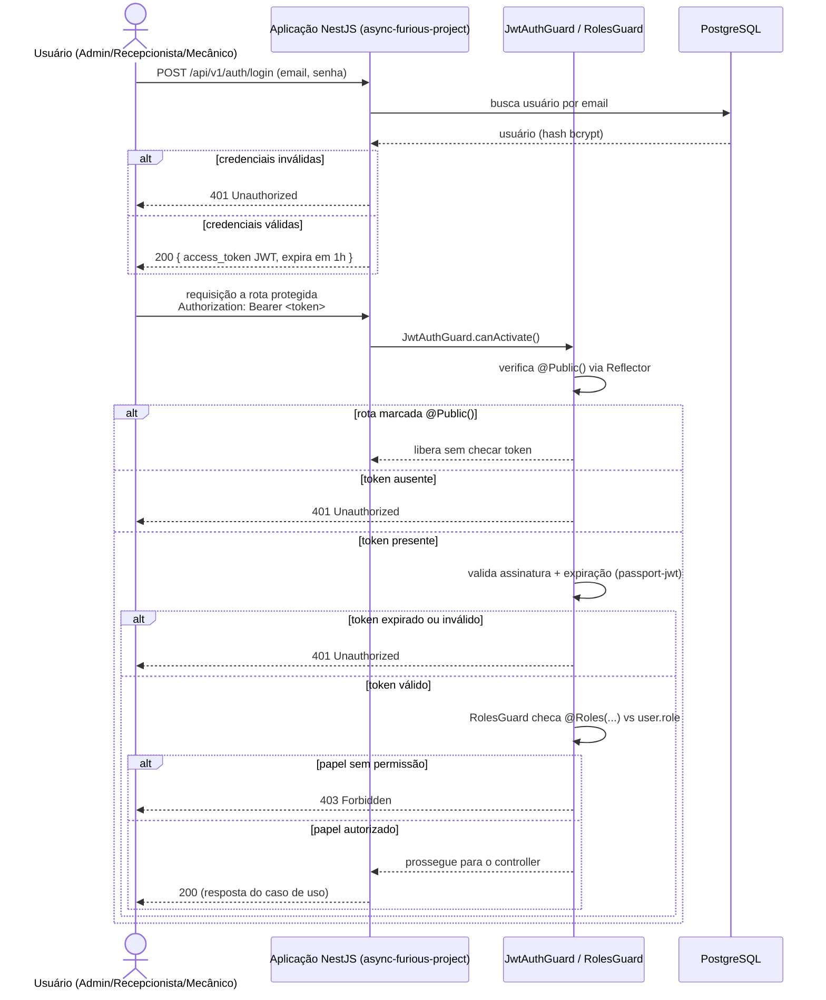
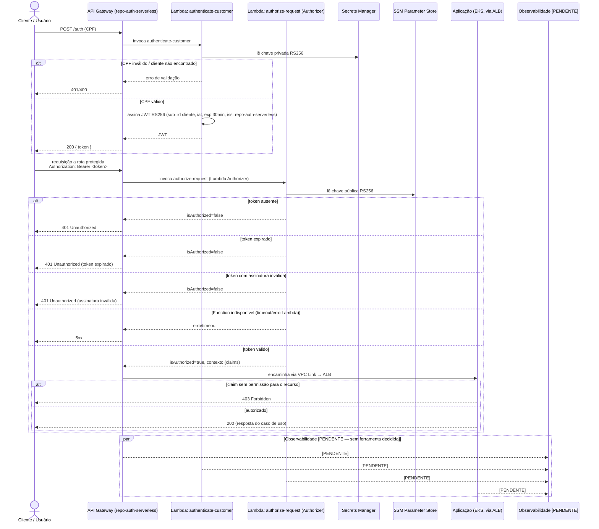

# Sequência de Autenticação

> Notação UML de sequência (Mermaid `sequenceDiagram`). Este fluxo **nunca foi
> diagramado** em `docs/` antes desta auditoria (confirmado por busca em todo
> o repositório) — reconstruído a partir do código (`src/auth/`, `src/main.ts`)
> para o estado atual, e das RFCs aceitas para a proposta Fase 3.

## 1. [ATUAL] — autenticação local dentro do monólito

Evidência: `src/auth/guards/jwt-auth.guard.ts`, `src/auth/guards/roles.guard.ts`,
`src/auth/strategies/jwt.strategy.ts`, `src/auth/decorators/public.decorator.ts`,
README.md (expiração de 1h, papéis `ADMIN`/`RECEPCIONISTA`/`MECANICO`).

**Observação**: hoje não existe nenhum envio de log/métrica/trace para uma
ferramenta de observabilidade neste fluxo — apenas o retorno HTTP (ver
[`docs/infrastructure/observability.md`](../infrastructure/observability.md)).

## 2. [PROPOSTA FASE 3] — autenticação centralizada via API Gateway + Function Serverless

Evidência: RFC-003 (trigo),
RFC-006 (trigo). **Os dois handlers Lambda são
esqueletos (`501`/`isAuthorized: false`) — este fluxo ainda não está
implementado, apenas decidido.**

### Diferenças-chave entre o fluxo atual e a proposta

| Aspecto | [ATUAL] | [PROPOSTA FASE 3] |
|---|---|---|
| Onde a autenticação acontece | Dentro do processo NestJS (`src/auth/`) | Em `repo-auth-serverless`, fora do processo da aplicação |
| Identificação | Email + senha (usuário administrativo) | CPF do cliente (RFC-006 (trigo)) — **`TODO`**: como/se os papéis `ADMIN`/`RECEPCIONISTA`/`MECANICO` (usuários administrativos) migram para este fluxo não está definido em nenhuma RFC encontrada; RFC-006 fala apenas de "customer" |
| Algoritmo de assinatura | `@nestjs/jwt` (HS256 por padrão, não confirmado explicitamente no código lido) | RS256, chave privada nunca sai de `repo-auth-serverless` |
| Validação nas rotas | `JwtAuthGuard` + `passport-jwt` dentro do próprio NestJS | Lambda Authorizer na borda, antes de chegar à aplicação |
| Expiração | 1 hora (README) | 30 minutos (RFC-006) |

**Pendência registrada**: nenhuma RFC ou ADR encontrada resolve como os
três papéis administrativos (`ADMIN`, `RECEPCIONISTA`, `MECANICO`) se
relacionam com o novo fluxo de `repo-auth-serverless`, que fala apenas de
"customer" (cliente final). Ver [ADR-0002](../adr/0002-autenticacao-centralizada-api-gateway-serverless.md).
