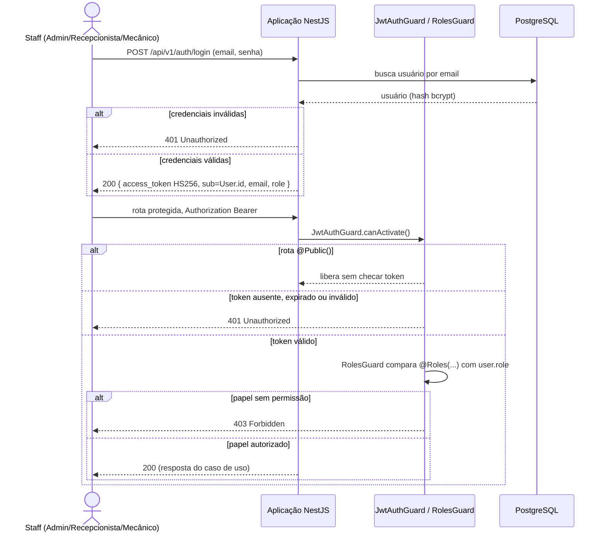
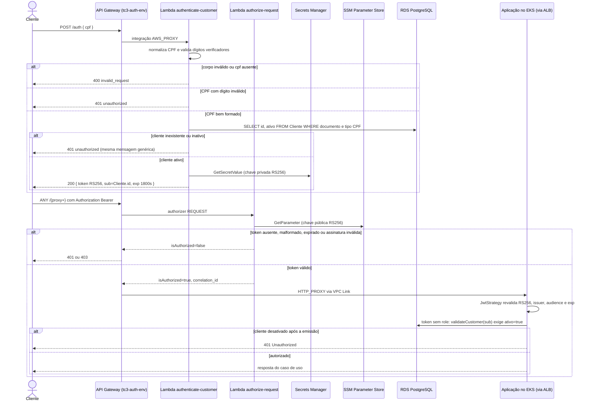
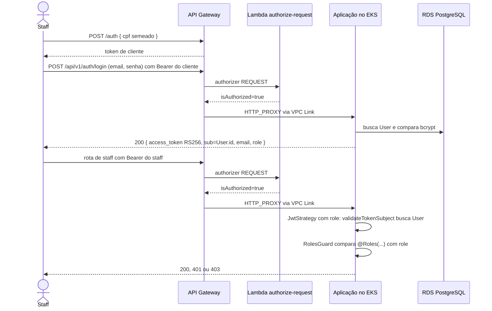

# Sequência de Autenticação

> Notação de sequência UML (Mermaid `sequenceDiagram`). Existem dois tipos de
> usuário (staff e cliente) e dois modos de execução, decididos pela variável
> `AUTH_MODE`: `local` no cluster `kind`, `gateway` em `hml` e `prod`.
>
> Detalhamento da borda em
> [api-gateway-lambda.md](../infrastructure/api-gateway-lambda.md); decisão em
> [ADR-0002](../adr/0002-autenticacao-centralizada-api-gateway-serverless.md).

## 1. Staff no ambiente local (`AUTH_MODE=local`)

Evidência: `src/auth/guards/jwt-auth.guard.ts`, `src/auth/guards/roles.guard.ts`,
`src/auth/strategies/jwt.strategy.ts`, `src/auth/jwt.config.ts`.

HS256 com `JWT_SECRET` só é aceito fora de produção: `resolveJwtContract`
recusa HS256 quando `NODE_ENV=production` e exige expiração de 1800 segundos.

## 2. Cliente nos ambientes AWS (`AUTH_MODE=gateway`)

Evidência: `repo-auth-serverless` (branch `main`), `src/auth/strategies/jwt.strategy.ts`,
`src/auth/services/auth.service.ts`.

## 3. Staff nos ambientes AWS (`AUTH_MODE=gateway`)

O login de staff continua dentro da aplicação, mas passa a assinar em RS256
com a **mesma chave privada** da Lambda: o `deploy-eks.yml` busca o secret
apontado por `JWT_PRIVATE_KEY_SECRET_ARN` e o injeta como `JWT_PRIVATE_KEY`.
Por isso o authorizer aceita o token de staff sem distinção.

Como `POST /api/v1/auth/login` não tem rota pública no API Gateway (cai em
`ANY /{proxy+}`, que exige authorizer), o staff precisa de um token válido
para alcançar o login. É o que o `full-acceptance.yml` faz: pede um token de
cliente em `POST /auth` e o usa como `Bearer` na chamada de login.

## 4. Contraste

| Aspecto | Staff, local | Staff, AWS | Cliente, AWS |
|---|---|---|---|
| Quem emite | aplicação | aplicação | Lambda `authenticate-customer` |
| Credencial | e-mail e senha | e-mail e senha | CPF |
| Algoritmo | HS256 | RS256 (chave compartilhada com a Lambda) | RS256 |
| Claims | `sub`=`User.id`, `email`, `role` | idem | só `sub`=`Cliente.id` |
| Primeira barreira | `JwtAuthGuard` | Lambda Authorizer | Lambda Authorizer |
| Resolução na aplicação | `validateTokenSubject` | `validateTokenSubject` | `validateCustomer` |
| Expiração | 1800s | 1800s | 1800s |

`JwtCustomerStrategy` e `JwtCustomerAuthGuard` existem (PR #182) e
`Role.CLIENTE` está no enum de papéis, mas nenhuma rota fora de `src/auth/`
usa `JwtCustomerAuthGuard` ou `@Roles(Role.CLIENTE)` hoje. Os tokens de
cliente são resolvidos pela `JwtStrategy` padrão.

## 5. Pendências

- O login de staff na AWS depende de um token prévio para atravessar o
  authorizer. Não há rota pública de login de staff nem decisão registrada
  sobre esse encadeamento.
- A chave privada RS256 é compartilhada entre a Lambda e a aplicação, o que
  contradiz a premissa da RFC-006 de que ela nunca sai de
  `repo-auth-serverless`.
- `validateCustomer`, usado pela `JwtStrategy` para tokens sem `role`, atribui
  `Role.RECEPCIONISTA` ao cliente; `validateTokenSubject` e
  `JwtCustomerStrategy` atribuem `Role.CLIENTE`. Um token de cliente pode,
  portanto, satisfazer `@Roles(Role.RECEPCIONISTA)` nos ambientes AWS. Não
  verifiquei rota a rota se isso é explorável; merece revisão.
- A rota `POST /auth` não tem throttling nem WAF.
