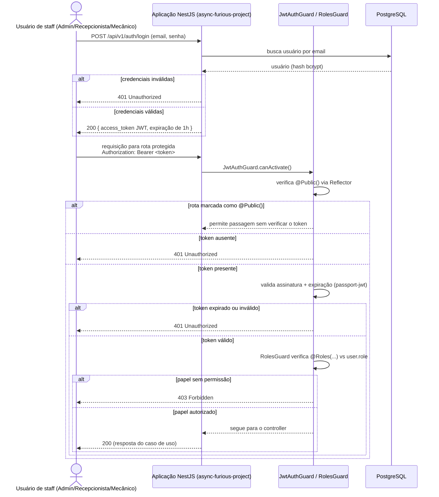

# Sequência de Autenticação

> Notação de sequência UML (Mermaid `sequenceDiagram`). Atualizado para
> refletir o estado após o PR #182 (`feat/customer-jwt-rs256-auth`), que
> adicionou o consumo de JWTs de clientes emitidos externamente, e após o
> `repo-auth-serverless` entregar seus handlers Lambda (não são mais
> esqueletos).

## 1. Autenticação de staff — local, inalterada

Evidências: `src/auth/guards/jwt-auth.guard.ts`, `src/auth/guards/roles.guard.ts`,
`src/auth/strategies/jwt.strategy.ts`, `src/auth/decorators/public.decorator.ts`,
README.md (expiração de 1h, papéis `ADMIN`/`RECEPCIONISTA`/`MECANICO`).



**Observação**: hoje este fluxo não emite nenhum log/métrica/trace para uma
ferramenta de observabilidade — apenas a resposta HTTP (veja
[`docs/infrastructure/observability.md`](../infrastructure/observability.md)).

## 2. Autenticação de cliente — API Gateway + Function Serverless (implementado)

Evidências: RFC-003, RFC-006 (aceitas), README/CI do `repo-auth-serverless`
(handlers implementados e implantados, não são mais esqueletos), e
`src/auth/strategies/jwt-customer.strategy.ts` /
`src/auth/guards/jwt-customer-auth.guard.ts` neste repositório (PR #182).

```mermaid
sequenceDiagram
    actor C as Cliente
    participant GW as API Gateway (repo-auth-serverless)
    participant AuthFn as Lambda: authenticate-customer
    participant AuthzFn as Lambda: authorize-request (Authorizer)
    participant Secrets as Secrets Manager
    participant SSM as SSM Parameter Store
    participant App as Aplicação (JwtCustomerStrategy, RS256)
    participant Obs as Observabilidade [PENDENTE]

    C->>GW: POST /auth (CPF)
    GW->>AuthFn: invoca authenticate-customer
    AuthFn->>Secrets: lê a chave privada RS256
    alt CPF inválido / cliente não encontrado
        AuthFn-->>GW: erro de validação
        GW-->>C: 401/400
    else CPF válido
        AuthFn->>AuthFn: assina JWT RS256 (sub=Cliente.id, iat, exp 30min, iss=repo-auth-serverless, aud=async-furious-project)
        AuthFn-->>GW: JWT
        GW-->>C: 200 { token }
    end

    C->>GW: requisição para rota protegida<br/>Authorization: Bearer <token>
    GW->>AuthzFn: invoca authorize-request (Lambda Authorizer)
    AuthzFn->>SSM: lê a chave pública RS256
    alt token ausente
        AuthzFn-->>GW: isAuthorized=false
        GW-->>C: 401 Unauthorized
    else token expirado
        AuthzFn-->>GW: isAuthorized=false
        GW-->>C: 401 Unauthorized (token expirado)
    else token com assinatura inválida
        AuthzFn-->>GW: isAuthorized=false
        GW-->>C: 401 Unauthorized (assinatura inválida)
    else Function indisponível (timeout/erro de Lambda)
        AuthzFn-->>GW: erro/timeout
        GW-->>C: 5xx
    else token válido
        AuthzFn-->>GW: isAuthorized=true, contexto (claims)
        GW->>App: encaminha via VPC Link → ALB (quando a integração completa estiver implantada)
        App->>App: JwtCustomerStrategy reverifica assinatura RS256, issuer e audience; mapeia sub para AuthenticatedUser{role: CLIENTE}
        alt cliente inativo/desconhecido
            App-->>C: 401 Unauthorized
        else claim sem permissão para o recurso
            App-->>C: 403 Forbidden
        else autorizado
            App-->>C: 200 (resposta do caso de uso)
        end
    end

    par Observabilidade [PENDENTE — nenhuma ferramenta definida]
        GW-->>Obs: [PENDENTE]
        AuthFn-->>Obs: [PENDENTE]
        AuthzFn-->>Obs: [PENDENTE]
        App-->>Obs: [PENDENTE]
    end
```

**Status do lado da aplicação**: `JwtCustomerStrategy` + `JwtCustomerAuthGuard`
estão implementados e testados neste repositório, e `Role.CLIENTE` foi
adicionado ao enum de papéis para que o `RolesGuard` existente funcione sem
alterações com tokens de cliente. Nenhuma rota de negócio está protegida por
`Role.CLIENTE` ainda — este PR entregou apenas a infraestrutura do lado do
consumidor para que uma futura rota possa aderir via
`@UseGuards(JwtCustomerAuthGuard, RolesGuard)` + `@Roles(Role.CLIENTE)`.

### Principais diferenças entre os dois fluxos

| Aspecto | Staff (local) | Cliente (externo) |
|---|---|---|
| Onde a autenticação acontece | Dentro do processo NestJS (`src/auth/`) | No `repo-auth-serverless`, fora do processo da aplicação |
| Identificação | Email + senha (usuário de staff) | CPF (`Cliente.documento`) |
| Algoritmo de assinatura | `@nestjs/jwt`, HS256 (`JWT_SECRET`) | RS256; a chave privada nunca sai do `repo-auth-serverless` |
| Validação da rota | `JwtAuthGuard` + `passport-jwt` dentro do NestJS | Lambda Authorizer na borda, depois `JwtCustomerAuthGuard` reverifica na aplicação |
| Expiração | 1 hora | 30 minutos |
| Subject do token | `User.id` (+ claims `email`, `role`) | Apenas `Cliente.id` (sem claims `email`/`role`) |

**Decisão registrada**: migrar os três papéis de staff (`ADMIN`,
`RECEPCIONISTA`, `MECANICO`) para o fluxo do gateway externo está
explicitamente fora do escopo por enquanto (veja a descrição do PR #182) — o
`repo-auth-serverless` autentica apenas clientes por CPF, e não existe Lambda
voltada a staff. O login/cadastro de staff (`AuthService`, `JwtStrategy`,
HS256) permanece local até que um desdobramento futuro decida como o staff
deve se autenticar. Veja
[ADR-0002](../adr/0002-autenticacao-centralizada-api-gateway-serverless.md).
