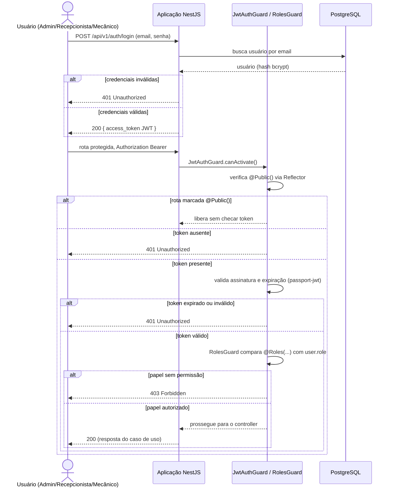
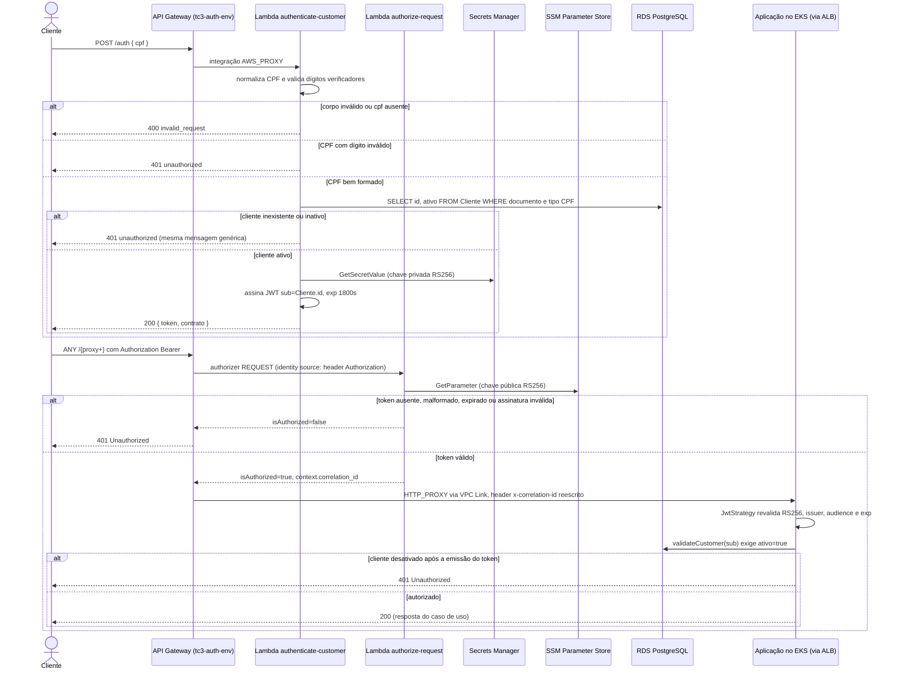

# Sequência de Autenticação

> Notação UML de sequência (Mermaid `sequenceDiagram`). Existem dois fluxos, e
> qual deles vale depende da variável `AUTH_MODE`: `local` no ambiente `kind`,
> `gateway` em `hml` e `prod`.
>
> Detalhamento da borda em
> [api-gateway-lambda.md](../infrastructure/api-gateway-lambda.md); decisão em
> [ADR-0002](../adr/0002-autenticacao-centralizada-api-gateway-serverless.md).

## 1. `AUTH_MODE=local` (ambiente `kind`)

Usuário administrativo autentica com e-mail e senha dentro do próprio NestJS.

Evidência: `src/auth/guards/jwt-auth.guard.ts`, `src/auth/guards/roles.guard.ts`,
`src/auth/strategies/jwt.strategy.ts`, `src/auth/decorators/public.decorator.ts`.

Neste modo o algoritmo é HS256 por padrão, com `JWT_SECRET` compartilhado.
`resolveJwtContract` recusa HS256 quando `NODE_ENV=production`
(`src/auth/jwt.config.ts:38`), então esse caminho é restrito a
desenvolvimento e teste.

## 2. `AUTH_MODE=gateway` (ambientes AWS)

Cliente autentica por CPF na borda. O monólito deixa de emitir token: `login`
e `register` respondem `401` neste modo
(`src/auth/services/auth.service.ts:19,50`).

### Por que a validação acontece duas vezes

O authorizer prova que o token é autêntico e não expirou. Ele não prova que o
cliente ainda está ativo, porque o token carrega identidade, não estado. Um
cliente desativado logo depois da emissão continuaria passando pela borda por
até 30 minutos. Por isso a aplicação revalida a assinatura e reconsulta o
banco a cada requisição.

O smoke test do deploy verifica exatamente a primeira camada: chama
`/api/v1/health/live` pelo gateway sem token e falha o pipeline se a resposta
não for `401` ou `403`.

## 3. Contraste entre os dois modos

| Aspecto | `AUTH_MODE=local` | `AUTH_MODE=gateway` |
|---|---|---|
| Onde autentica | dentro do processo NestJS | Lambda em `repo-auth-serverless` |
| Identificação | e-mail e senha (usuário administrativo) | CPF (cliente) |
| Algoritmo | HS256 (proibido em produção) | RS256, chave privada nunca sai da Lambda |
| `sub` | `User.id` | `Cliente.id` |
| Expiração | `JWT_EXPIRES_IN`, 1800s por padrão | 1800s, travado por validação no Terraform |
| Primeira barreira | `JwtAuthGuard` | Lambda Authorizer, antes de a requisição entrar na VPC |
| `login` e `register` | disponíveis | respondem 401 |

## 4. Pendências

- Não há fluxo de autenticação para os papéis administrativos (`ADMIN`,
  `RECEPCIONISTA`, `MECANICO`) nos ambientes AWS. A borda só autentica cliente
  por CPF e o login local está desligado. Nenhuma RFC resolve isso.
- `validateCustomer` atribui `Role.RECEPCIONISTA` a um cliente autenticado por
  CPF, enquanto `JwtCustomerStrategy` atribui `Role.CLIENTE` ao mesmo tipo de
  token. Qual estratégia atende cada rota protegida não está documentado.
- A rota `POST /auth` não tem throttling nem WAF.
