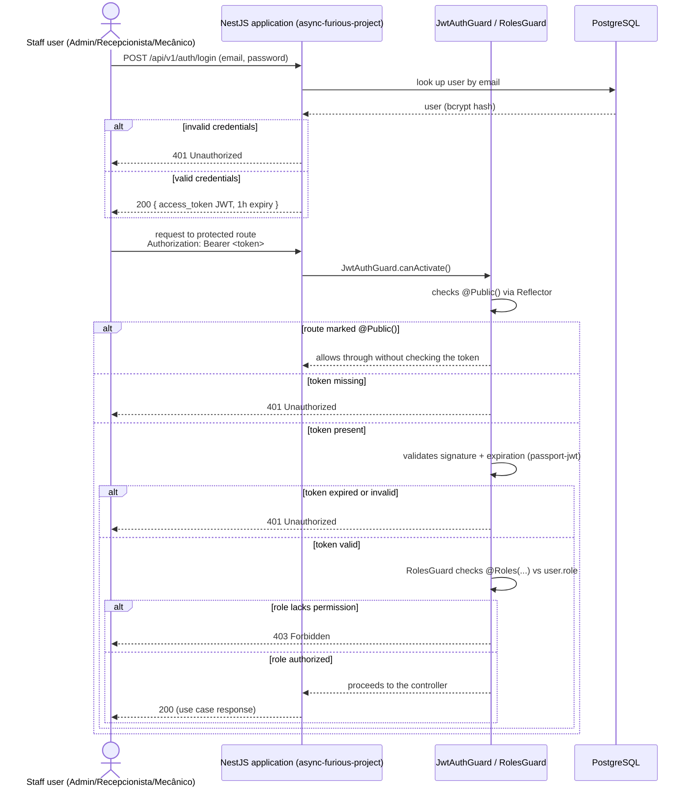

# Authentication Sequence

> UML sequence notation (Mermaid `sequenceDiagram`). Updated to reflect the
> state after PR #182 (`feat/customer-jwt-rs256-auth`), which added consumption
> of externally-issued customer JWTs, and after `repo-auth-serverless` shipped
> its Lambda handlers (no longer skeletons).

## 1. Staff authentication — local, unchanged

Evidence: `src/auth/guards/jwt-auth.guard.ts`, `src/auth/guards/roles.guard.ts`,
`src/auth/strategies/jwt.strategy.ts`, `src/auth/decorators/public.decorator.ts`,
README.md (1h expiry, `ADMIN`/`RECEPCIONISTA`/`MECANICO` roles).



**Note**: this flow does not emit any log/metric/trace to an observability
tool today — only the HTTP response (see
[`docs/infrastructure/observability.md`](../infrastructure/observability.md)).

## 2. Customer authentication — API Gateway + Function Serverless (implemented)

Evidence: RFC-003, RFC-006 (accepted), `repo-auth-serverless` README/CI
(handlers implemented and deployed, no longer skeletons), and
`src/auth/strategies/jwt-customer.strategy.ts` /
`src/auth/guards/jwt-customer-auth.guard.ts` in this repo (PR #182).

```mermaid
sequenceDiagram
    actor C as Customer (Cliente)
    participant GW as API Gateway (repo-auth-serverless)
    participant AuthFn as Lambda: authenticate-customer
    participant AuthzFn as Lambda: authorize-request (Authorizer)
    participant Secrets as Secrets Manager
    participant SSM as SSM Parameter Store
    participant App as Application (JwtCustomerStrategy, RS256)
    participant Obs as Observability [PENDING]

    C->>GW: POST /auth (CPF)
    GW->>AuthFn: invokes authenticate-customer
    AuthFn->>Secrets: reads RS256 private key
    alt invalid CPF / customer not found
        AuthFn-->>GW: validation error
        GW-->>C: 401/400
    else valid CPF
        AuthFn->>AuthFn: signs RS256 JWT (sub=Cliente.id, iat, exp 30min, iss=repo-auth-serverless, aud=async-furious-project)
        AuthFn-->>GW: JWT
        GW-->>C: 200 { token }
    end

    C->>GW: request to protected route<br/>Authorization: Bearer <token>
    GW->>AuthzFn: invokes authorize-request (Lambda Authorizer)
    AuthzFn->>SSM: reads RS256 public key
    alt token missing
        AuthzFn-->>GW: isAuthorized=false
        GW-->>C: 401 Unauthorized
    else token expired
        AuthzFn-->>GW: isAuthorized=false
        GW-->>C: 401 Unauthorized (expired token)
    else token with invalid signature
        AuthzFn-->>GW: isAuthorized=false
        GW-->>C: 401 Unauthorized (invalid signature)
    else Function unavailable (timeout/Lambda error)
        AuthzFn-->>GW: error/timeout
        GW-->>C: 5xx
    else valid token
        AuthzFn-->>GW: isAuthorized=true, context (claims)
        GW->>App: forwards via VPC Link → ALB (when full integration is deployed)
        App->>App: JwtCustomerStrategy verifies RS256 signature, issuer, audience again; maps sub to AuthenticatedUser{role: CLIENTE}
        alt inactive/unknown customer
            App-->>C: 401 Unauthorized
        else claim lacks permission for the resource
            App-->>C: 403 Forbidden
        else authorized
            App-->>C: 200 (use case response)
        end
    end

    par Observability [PENDING — no tool decided]
        GW-->>Obs: [PENDING]
        AuthFn-->>Obs: [PENDING]
        AuthzFn-->>Obs: [PENDING]
        App-->>Obs: [PENDING]
    end
```

**Application-side status**: `JwtCustomerStrategy` + `JwtCustomerAuthGuard`
are implemented and tested in this repo, and `Role.CLIENTE` was added to the
role enum so the existing `RolesGuard` works unchanged for customer tokens.
No business route is protected by `Role.CLIENTE` yet — this PR only delivered
the consumer-side infrastructure so a future route can opt in via
`@UseGuards(JwtCustomerAuthGuard, RolesGuard)` + `@Roles(Role.CLIENTE)`.

### Key differences between the two flows

| Aspect | Staff (local) | Customer (external) |
|---|---|---|
| Where authentication happens | Inside the NestJS process (`src/auth/`) | In `repo-auth-serverless`, outside the application process |
| Identification | Email + password (staff user) | CPF (`Cliente.documento`) |
| Signing algorithm | `@nestjs/jwt`, HS256 (`JWT_SECRET`) | RS256; private key never leaves `repo-auth-serverless` |
| Route validation | `JwtAuthGuard` + `passport-jwt` inside NestJS | Lambda Authorizer at the edge, then `JwtCustomerAuthGuard` re-verifies in-app |
| Expiration | 1 hour | 30 minutes |
| Token subject | `User.id` (+ `email`, `role` claims) | `Cliente.id` only (no `email`/`role` claims) |

**Recorded decision**: migrating the three staff roles (`ADMIN`,
`RECEPCIONISTA`, `MECANICO`) to the external gateway flow is explicitly out of
scope for now (see PR #182's description) — `repo-auth-serverless` only
authenticates customers by CPF, and no staff-facing Lambda exists. Staff
login/registration (`AuthService`, `JwtStrategy`, HS256) remains local until a
follow-up decides how staff authenticate. See
[ADR-0002](../adr/0002-autenticacao-centralizada-api-gateway-serverless.md).
