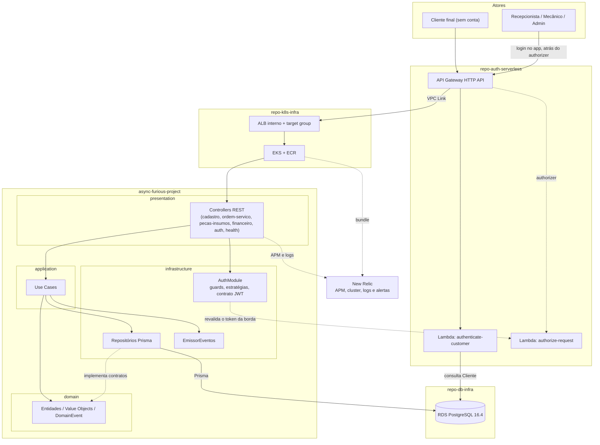

# Diagrama de Componentes

> Convenção C4 (nível Component), em Mermaid. Todos os componentes abaixo estão
> implementados.

## Tabela de componentes

| Componente | Repositório | Responsabilidade | Tecnologia | Comunica-se com |
|---|---|---|---|---|
| API Gateway | `repo-auth-serverless` | Ponto de entrada único; `POST /auth` público e `ANY /{proxy+}` protegido | AWS API Gateway HTTP API v2, stage `$default` com auto deploy | Ambas as Lambdas e o ALB interno via VPC Link |
| `authenticate-customer` | `repo-auth-serverless` | Valida dígitos do CPF, confirma cliente ativo, emite JWT | AWS Lambda `nodejs22.x`, RS256, dentro da VPC | Secrets Manager (chave privada) e RDS por conexão direta com pool de até 2 conexões |
| `authorize-request` | `repo-auth-serverless` | Lambda Authorizer: valida assinatura, emissor, audiência e expiração | AWS Lambda `nodejs22.x`, `enable_simple_responses` | SSM Parameter Store (chave pública) |
| ALB interno e target group | `repo-k8s-infra` | Alvo privado do VPC Link; entrega aos pods registrados por IP | ALB `internal`, listener HTTP 80, `targetType: ip` | Cluster EKS, via `TargetGroupBinding` |
| Cluster EKS, VPC e ECR | `repo-k8s-infra` | Orquestração dos workloads, posse da rede e registry de imagens | Terraform, EKS 1.30, nós `t3.small` (SPOT em HML, ON_DEMAND em PROD), ECR com tag imutável | `repo-db-infra`, que lê seus outputs pelo estado remoto |
| Aplicação NestJS | `async-furious-project` | Quatro Bounded Contexts de negócio mais o módulo transversal `auth` | NestJS, TypeScript, Prisma, Clean Architecture e DDD | RDS por Prisma; valida tokens da borda e emite tokens RS256 de staff quando `AUTH_MODE=gateway` |
| RDS PostgreSQL | `repo-db-infra` | Banco gerenciado | Amazon RDS, PostgreSQL 16.4, TLS obrigatório, Multi-AZ apenas em produção | Aplicação e Lambda de autenticação; credenciais por master password gerenciada no Secrets Manager |
| Observabilidade | `repo-k8s-infra` e `async-furious-project` | APM, métricas do cluster, logs, dashboard e alertas | New Relic ([ADR-0005](../adr/0005-observabilidade.md)): agente Node na aplicação, `nri-bundle` no cluster, alertas por e-mail. Lambdas e RDS seguem em CloudWatch | Aplicação e cluster; Lambdas e RDS fora da New Relic |

## O que aconteceu com o AuthModule local

Versões anteriores deste documento registravam como pendência se o
`AuthModule` seria removido, mantido como segunda camada ou adaptado. O código
respondeu: ele foi **mantido**, com duas funções, e a variável `AUTH_MODE`
decide o algoritmo.

| `AUTH_MODE` | O que o `AuthModule` faz |
|---|---|
| `local` | Emite e valida tokens HS256. Login por e-mail e senha; HS256 é recusado em produção por `resolveJwtContract` |
| `gateway` | Revalida tokens RS256 de cliente (emitidos pela Lambda) e emite tokens RS256 de staff no `POST /api/v1/auth/login`, com a mesma chave privada da Lambda, injetada pelo `deploy-eks.yml` |

Para o cliente, a extração para `repo-auth-serverless` foi da emissão do
token. Para o staff, a emissão continua na aplicação. Em ambos os casos a
verificação acontece duas vezes, na borda e na aplicação, porque o token
carrega identidade e não estado. Ver
[authentication-flow.md](./authentication-flow.md) e
[ADR-0002](../adr/0002-autenticacao-centralizada-api-gateway-serverless.md).
