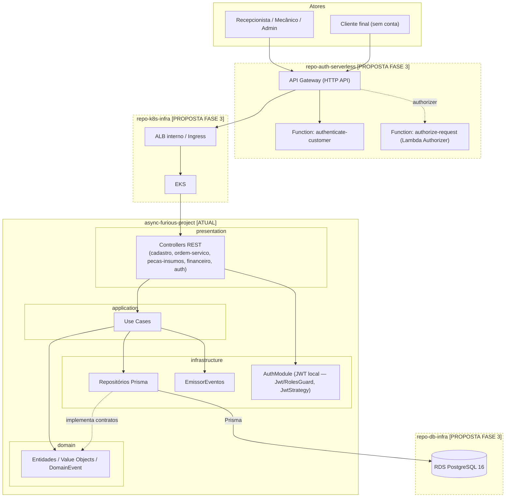

# Diagrama de Componentes

> Convenção C4 (nível Component), adaptada com Mermaid — a mesma tecnologia de
> diagrama-como-código já usada no restante do repositório (`.mmd` em
> `docs/context-map/`, `docs/event-storming/`, `docs/others/`, e o diagrama
> Mermaid já existente em `README.md`). Componentes com borda tracejada =
> **proposta Fase 3**, ainda não implantada. Componentes com borda sólida =
> **implementados hoje**.

## Tabela de componentes

| Componente | Repositório | Responsabilidade | Tecnologia | Comunica-se com |
|---|---|---|---|---|
| API Gateway | `repo-auth-serverless` **[PROPOSTA]** | Ponto de entrada único; roteia `/auth/*` e demais rotas protegidas | AWS API Gateway (HTTP API) — RFC-003 (trigo) | `authenticate-customer`, `authorize-request` (Lambda Authorizer), ALB interno via VPC Link |
| `authenticate-customer` | `repo-auth-serverless` **[PROPOSTA — esqueleto]** | Valida CPF do cliente, verifica existência/status, emite JWT | AWS Lambda (Node.js/TypeScript), assinatura RS256 — RFC-006 (trigo) | AWS Secrets Manager (chave privada); `[PENDENTE]` conectividade com dados do cliente (RDS direto vs. RDS Proxy — decisão explicitamente em aberto na RFC-006) |
| `authorize-request` | `repo-auth-serverless` **[PROPOSTA — esqueleto]** | Lambda Authorizer: valida assinatura e claims do JWT nas rotas protegidas | AWS Lambda, verificação RS256 via chave pública | SSM Parameter Store (chave pública) |
| ALB interno / Ingress | `repo-k8s-infra` **[PROPOSTA — esqueleto]** | Alvo de integração privado do API Gateway (VPC Link); roteamento por path/host para a aplicação (e futuros microsserviços) | AWS Load Balancer Controller via Kubernetes Ingress | Cluster EKS |
| Cluster EKS / VPC | `repo-k8s-infra` **[PROPOSTA — esqueleto]** | Orquestração dos workloads da aplicação; posse da rede (VPC, subnets, rotas) | Terraform + Amazon EKS — RFC-004 (trigo) | `repo-db-infra` (consome `vpc_id`/subnets como output) |
| Aplicação NestJS (`async-furious-project`) | `async-furious-project` **[ATUAL]** | 4 Bounded Contexts de negócio: `cadastro`, `ordem-servico`, `pecas-insumos`, `financeiro` + módulo transversal `auth` | NestJS 10, TypeScript, Prisma, Clean Architecture + DDD | PostgreSQL (via Prisma); hoje autentica localmente (JWT + bcrypt), na proposta passa a confiar no JWT emitido por `repo-auth-serverless` |
| RDS PostgreSQL | `repo-db-infra` **[PROPOSTA — esqueleto]** | Banco de dados gerenciado, engine/versão definidos | Amazon RDS, PostgreSQL 16 — RFC de banco (trigo) | Consumida pela aplicação (Prisma); credenciais via RDS-managed master password + Secrets Manager |
| Observabilidade | — **[PENDENTE — sem decisão]** | Logs, métricas e tracing centralizados | Nenhuma ferramenta decidida ou implementada (ver [observability.md](../infrastructure/observability.md)) | Todos os componentes acima, quando implementada |

## Componente atual não substituído pela proposta

O `AuthModule` local (JWT + bcrypt, `src/auth/`) continua existindo e
funcional hoje. A proposta Fase 3 não remove esse código — ela adiciona uma
camada de autenticação centralizada **na borda** (API Gateway). `TODO`:
nenhuma RFC/ADR encontrada define explicitamente se o `AuthModule` local será
removido, mantido como segunda camada de validação, ou adaptado para apenas
verificar claims do JWT emitido por `repo-auth-serverless` — está registrado
como pendência em [ADR-0002](../adr/0002-autenticacao-centralizada-api-gateway-serverless.md).
