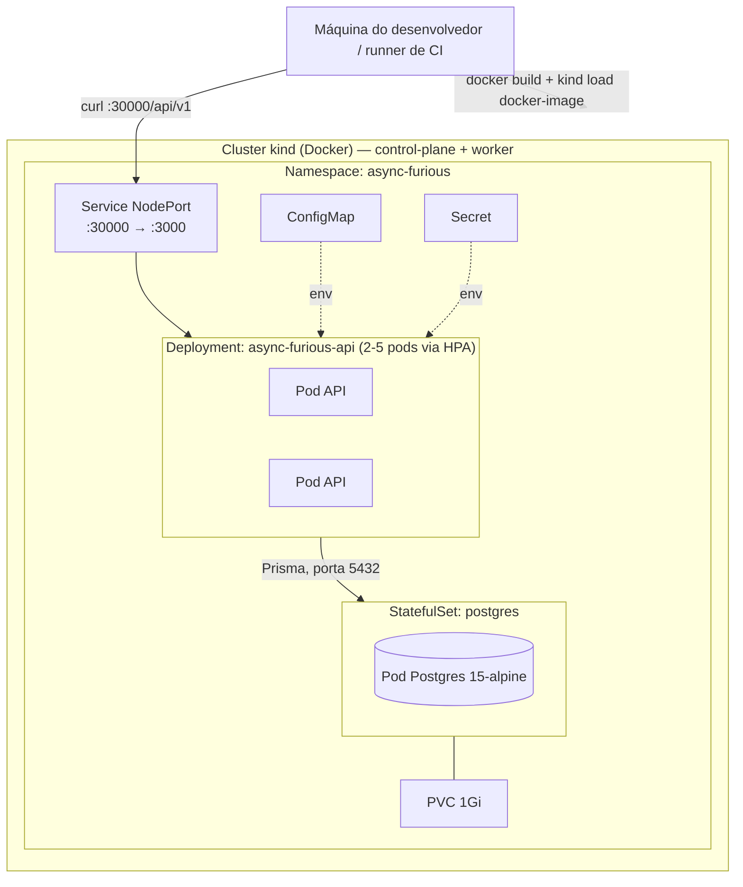
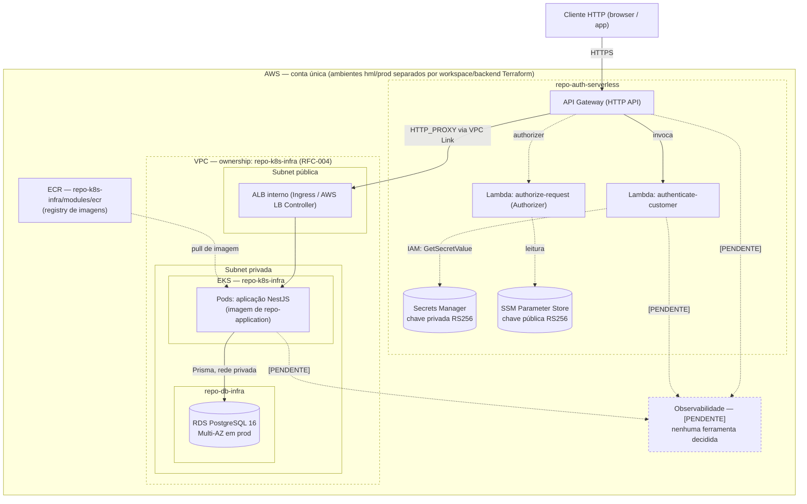

# Diagrama de Implantação (Deployment)

> Notação UML de implantação, expressa em Mermaid (mesma tecnologia de
> diagrama-como-código já usada no repositório). Dois diagramas: o ambiente
> **[ATUAL]**, que de fato roda (local, via `kind`), e o ambiente **[PROPOSTA
> FASE 3]**, decidido nas RFCs mas ainda não aplicado (todos os três
> repositórios de infraestrutura estão em estágio de esqueleto, sem
> `terraform apply` executado — fonte: README de cada repositório).

## 1. [ATUAL] — ambiente local (kind + Terraform)

Evidência: `infra/environments/local/`, `k8s/*.yaml`,
`docs/superpowers/specs/2026-06-22-terraform-kubernetes-design.md`.

- **Registry de imagens**: nenhum — a imagem é construída localmente
  (`docker build`) e carregada diretamente nos nós do `kind`
  (`kind load docker-image`, necessário por `imagePullPolicy: Never`).
- **Init containers**: `migrate` (`prisma migrate deploy`) e `seed` rodam
  antes do container principal em cada pod da API.
- **Probes**: liveness/readiness apontam para `GET /api/v1` (não `/health`).
- **CI/CD**: PRs que tocam `infra/**`/`k8s/**` rodam `terraform validate`+`plan`
  (`.github/workflows/terraform.yml`); push em `main`/`develop` roda um job
  adicional que sobe um cluster `kind` efêmero no próprio runner, aplica,
  testa e destrói tudo — nunca toca infraestrutura de nuvem persistente.
- **Observabilidade**: nenhuma.

## 2. [PROPOSTA FASE 3] — ambiente-alvo AWS

Evidência: `repo-k8s-infra` (`modules/vpc`, `modules/eks`, `modules/ecr`),
`repo-db-infra` (`modules/rds`), `repo-auth-serverless` (dois handlers
Lambda), RFC-003, RFC-004, RFC-006, `database-justification.md`. **Nenhum
destes módulos foi aplicado (`terraform apply`) — todos em estágio de
esqueleto.**

### Limites de rede

- **API Gateway**: público, na borda.
- **VPC** (`repo-k8s-infra`): rede privada; RDS e pods da aplicação não são
  publicamente acessíveis — apenas o ALB interno é alvo do VPC Link do API
  Gateway (RFC-003 (trigo)).
- **`repo-db-infra` não cria VPC própria** — consome `vpc_id` e
  `private_subnet_ids` como outputs Terraform de `repo-k8s-infra`
  (RFC-004 (trigo)); ordem de provisionamento
  obrigatória: rede antes de banco.

### Protocolos

| Trecho | Protocolo |
|---|---|
| Cliente → API Gateway | HTTPS |
| API Gateway → Lambda (auth/authorizer) | invocação Lambda (AWS SDK interno) |
| API Gateway → ALB | HTTP via VPC Link (`HTTP_PROXY` integration) |
| ALB → Pods EKS | HTTP |
| Aplicação → RDS | PostgreSQL wire protocol (via Prisma), rede privada |
| Lambdas → Secrets Manager / SSM | HTTPS (AWS SDK), IAM-scoped |

### Pendências explícitas deste diagrama

- **Observabilidade**: nenhuma ferramenta, nenhum fluxo de logs/métricas/
  traces decidido. `TODO`.
- **CI/CD de deploy real dos 3 repositórios satélite**: cada um tem apenas
  `ci.yml` de validação (`terraform fmt`/`validate`, ou `lint`/`typecheck`/
  `test`); não há pipeline de `apply` em nenhum dos três. Branches como
  `ci/eks-pipeline-plan-apply-trivy` e `ci/rds-pipeline-plan-apply-trivy`
  existem mas não foram inspecionadas em detalhe nesta auditoria — `TODO`
  para uma futura revisão confirmar seu conteúdo antes de declarar o pipeline
  pronto.
- **Ambiente hml vs prod**: `repo-k8s-infra` e `repo-db-infra` têm diretórios
  `environments/hml` e `environments/prod` com apenas `backend.tf` — sem
  `main.tf`/variáveis por ambiente confirmadas nesta auditoria.
