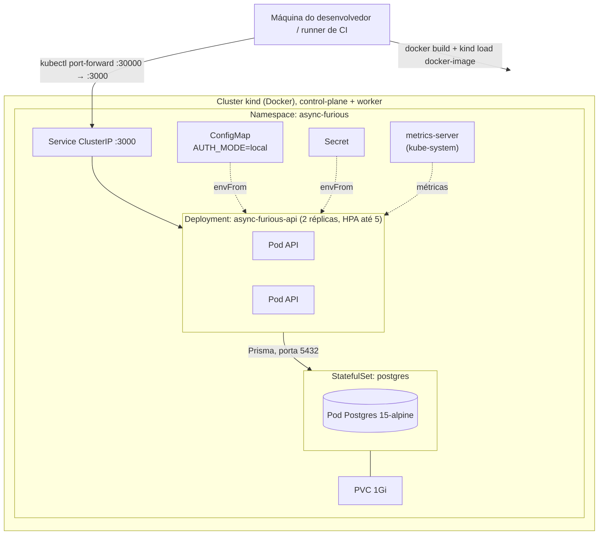
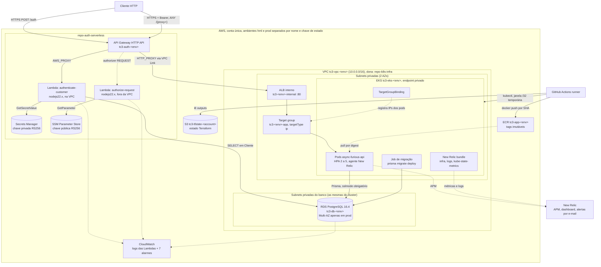

# Diagrama de Implantação (Deployment)

> Notação UML de implantação, expressa em Mermaid. Dois ambientes, ambos
> implementados: o local, via `kind`, e o de nuvem, em EKS nos ambientes `hml`
> e `prod`.
>
> Detalhamento dos recursos em [aws.md](../infrastructure/aws.md),
> [kubernetes.md](../infrastructure/kubernetes.md) e
> [api-gateway-lambda.md](../infrastructure/api-gateway-lambda.md).

## 1. Ambiente local (kind + Terraform)

Evidência: `infra/environments/local/`, `infra/modules/kubernetes-apps/`,
`k8s/*.yaml`, `scripts/local-up.sh`.

- **Registry**: nenhum. A imagem `async-furious-api:local` é construída
  localmente e carregada nos nós com `kind load docker-image`, necessário a
  cada mudança de código porque `imagePullPolicy` é `IfNotPresent`.
- **Banco**: dentro do cluster, controlado pela variável
  `enable_local_database`. Desligada, o módulo aceita uma `database_url`
  externa.
- **Probes**: readiness em `/api/v1/health/ready`, liveness e startup em
  `/api/v1/health/live`.
- **Acesso**: `kubectl port-forward`, não NodePort.
- **Autenticação**: `AUTH_MODE=local`, com login por e-mail e senha dentro do
  próprio NestJS.
- **CI**: `terraform.yml` sobe um cluster `kind` efêmero no runner, aplica,
  inspeciona e descarta. Nunca toca nuvem persistente.

## 2. Ambiente AWS (hml e prod)

Evidência: branch `main` de `repo-k8s-infra`, `repo-db-infra` e
`repo-auth-serverless`, `.github/workflows/deploy-eks.yml`,
`k8s/app/target-group-binding.yaml`.

### Limites de rede

- **API Gateway** é o único componente público. Nem ALB, nem cluster, nem pods
  são alcançáveis diretamente da internet.
- **ALB é interno** e seu security group só aceita tráfego do CIDR da própria
  VPC. Ele nunca é internet-facing.
- **Endpoint da API do Kubernetes é privado** por padrão. O pipeline abre uma
  janela temporária apenas para o IP do runner, com máscara `/32`, e restaura a
  configuração original em passo `if: always()`.
- **RDS é privado nos dois ambientes**: fica nas subnets privadas publicadas
  por `repo-k8s-infra`, com `publicly_accessible = false` e um `precondition`
  que falha o plano se alguma subnet tiver rota para Internet Gateway. O
  ingresso difere: CIDRs explícitos em `hml`, apenas security groups em
  `prod`. A [RFC-007](../rfcs/RFC-007-rds-public-access.md), que propunha
  RDS público em HML, está superada.
- **Ordem de provisionamento é obrigatória**: `repo-db-infra` lê o estado de
  `repo-k8s-infra` para descobrir VPC, subnets e security group dos nós
  ([RFC-004](../rfcs/RFC-004-vpc-ownership.md)).

### Protocolos

| Trecho | Protocolo |
|---|---|
| Cliente → API Gateway | HTTPS |
| API Gateway → Lambdas | invocação Lambda (`AWS_PROXY`, payload 2.0) |
| API Gateway → ALB | HTTP via VPC Link (`HTTP_PROXY`, payload 1.0) |
| ALB → Pods | HTTP na porta 3000, alvos registrados por IP |
| Aplicação e Lambda → RDS | PostgreSQL, TLS obrigatório (`rds.force_ssl=1`) |
| Lambdas → Secrets Manager e SSM | HTTPS, escopo IAM |
| Runner → ECR e EKS | HTTPS, credenciais de sessão Academy |

### Diferenças entre hml e prod

| Aspecto | hml | prod |
|---|---|---|
| Ingresso no RDS (privado nos dois) | CIDRs explícitos | só security group |
| Multi-AZ | não | sim |
| Retenção de backup | 1 dia | 1 dia |
| Proteção de deleção | não | sim |
| Nós do EKS | SPOT | ON_DEMAND |
| Seed | só em disparo manual, com `seed_customer` ou `seed_comprehensive` | só em disparo manual, com `seed_prod`, `seed_customer` ou `seed_comprehensive` |
| Gatilho de deploy | push em `develop` | push em `main`, ou manual a partir de `main` |
| Remoção | apaga o namespace | apaga apenas os recursos criados pelo deploy |

### Pendências deste diagrama

- **TLS interno**: o ALB serve HTTP na porta 80, sem certificado. O TLS termina
  no API Gateway. Exceção registrada com `#trivy:ignore:AWS-0054` no código de
  `repo-k8s-infra`, por não haver ACM nem domínio contratado.
- **Alarmes CloudWatch sem destino na borda**: os quatro alarmes de
  `repo-auth-serverless` usam `alarm_actions = []`; os três do RDS dependem dos
  secrets `*_ALARM_ACTIONS` do pipeline. A notificação por e-mail existe apenas
  nos alertas da New Relic, que cobrem aplicação e cluster.
