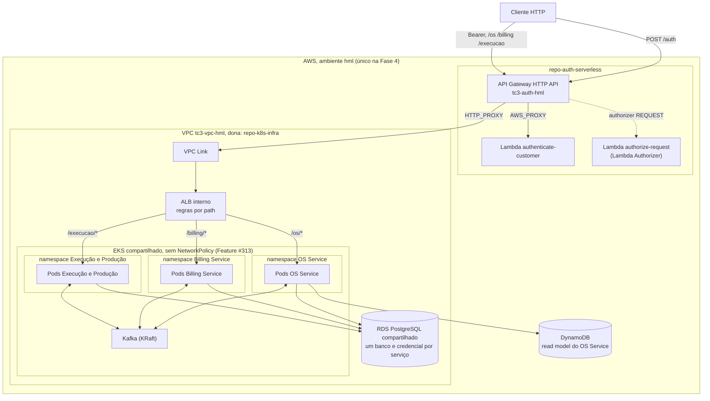

# Topologia de Infraestrutura e Borda (Fase 4)

> Desenho-alvo da Fase 4, decidido na [ADR-0021](../adr/0021-borda-sem-bff.md).
> O que está implantado hoje (um único serviço atrás do ALB) está em
> [deployment-diagram.md](./deployment-diagram.md). Este documento descreve o
> alvo; a implementação é escopo dos Epics de Plataforma e de cada serviço.

## 1. Diagrama

Não há BFF: o API Gateway fala direto com o ALB, e o ALB com cada serviço. Cada serviço valida o JWT localmente além do Authorizer da borda.

## 2. Mapa de roteamento

| Path no API Gateway | Autenticação | Destino | Observação |
|---|---|---|---|
| `POST /auth` | pública | Lambda `authenticate-customer` | inalterada da Fase 3 |
| `ANY /{proxy+}` | Lambda Authorizer | ALB → serviço por path (`/os`, `/billing`, `/execucao`) | rota única no Gateway |
| rotas públicas de orçamento | nenhuma no Gateway | Billing Service | `@Public()`, ADR-0011 |
| webhook do Mercado Pago | nenhuma no Gateway (assinatura HMAC) | Billing Service | `POST /billing/webhooks/mercado-pago` |

Consequências para a implementação (Epic de Plataforma):

- **Um destino por path no ALB.** Hoje há um único target group
  (`tc3-<env>-app`); são necessários três, um por serviço, com regras de
  listener por prefixo de path (`aws_lb_listener_rule` em
  `repo-k8s-infra/modules/alb`), cada um com seu `TargetGroupBinding`. O Gateway
  mantém a rota `/{proxy+}` única, então Authorizer e
  `overwrite:header.x-correlation-id` continuam declarados num lugar só
  (Feature #317).
- **Prefixo de path.** A aplicação hoje serve em `/api/v1/...`
  (`setGlobalPrefix('api/v1')` em `src/main.ts`). Ou o Gateway remove o prefixo
  (`/os`) antes de encaminhar, ou cada serviço incorpora o prefixo no seu prefixo
  global. A escolha é detalhe de implementação e deve ser feita uma vez, igual
  para os três serviços.
- **Rotas públicas novas.** Hoje `ANY /{proxy+}` usa `authorization_type = CUSTOM`
  e o Authorizer nega requisição sem Bearer; por isso as rotas `@Public()` de
  aprovação de orçamento não são alcançáveis pelo Gateway. Precisam de rota
  explícita sem authorizer apontando para o Billing (Feature #317). O webhook do
  Mercado Pago precisa da mesma rota sem authorizer, porque o provedor não
  apresenta o nosso JWT; a proteção é a assinatura (Feature #325).

## 3. Autenticação nos serviços

- **Duas camadas.** O Lambda Authorizer valida o token na borda; cada serviço
  valida o JWT de novo localmente, com `src/auth/` copiado do OS Service
  (`jwt.strategy.ts`, `JwtAuthGuard`, `RolesGuard`, enum de papéis).
- **Sem `NetworkPolicy`** (Feature #313): não há isolamento de rede entre pods,
  então a validação local é o que impede acesso direto a um pod sem token.
- **RBAC local.** O papel e o `sub` saem do token validado no serviço. O
  Authorizer não propaga claims por header.
- **Emissão de token de staff.** `POST /api/v1/auth/login` e o `User` ficam no
  OS Service; os demais serviços só validam.
- **Rotas sem token** são exceção explícita, marcadas como públicas no serviço
  e com rota sem authorizer no Gateway (seção 2).

## 4. Desenvolvimento local

Fora da borda (`pnpm run dev`, cluster `kind` via `scripts/local-up.sh`) não
existe API Gateway nem Authorizer. Os serviços novos reaproveitam o modo local
da Fase 3 (`AUTH_MODE=local`, HS256), que `resolveJwtContract` recusa em
produção, e o desenvolvedor usa um token de teste. Não há variável de bypass
nova.

## 5. Ambientes

A Fase 4 é **HML-only**. Não haverá PROD dos serviços novos nem workflow de
deploy para PROD na Fase 4; o PROD da Fase 3 (monólito) não é alterado por esta
decisão.

## 6. Cluster e banco compartilhados

Um único cluster EKS e uma única instância RDS por ambiente atendem aos três
serviços, em namespaces/deployments e bancos/credenciais separados. A
justificativa por escrito, com o trade-off de ponto único de falha, está na
[ADR-0020](../adr/0020-bancos-compartilhados-isolamento-credencial.md). O
dimensionamento de nós e a capacidade (em especial o Kafka) são escopo do Epic
de Plataforma.
