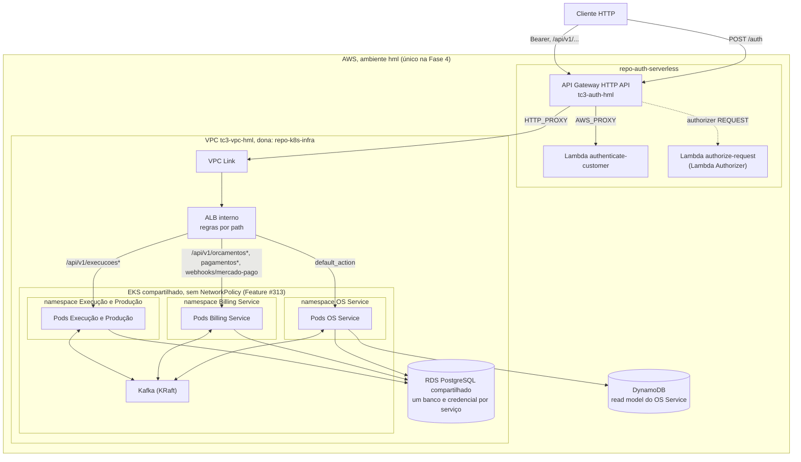

# Topologia de Infraestrutura e Borda (Fase 4)

> Desenho-alvo da Fase 4, decidido na [ADR-0021](../adr/0021-borda-sem-bff.md).
> O que está implantado hoje (um único serviço atrás do ALB) está em
> [deployment-diagram.md](./deployment-diagram.md). Este documento descreve o
> alvo; a implementação é escopo dos Epics de Plataforma e de cada serviço.
>
> **Revisão de 30/09/2026 (`rev/Epic_1`).** URLs finais `/api/v1/<recurso>` em
> todos os serviços, com o ALB roteando por `path_pattern` de recurso
> (descartados `/os`, `/billing`, `/execucao`); rotas públicas como rotas
> específicas no Gateway (`GET .../status`, `PATCH .../orcamentos/{ordemServicoId}/aprovar|recusar`,
> `POST .../webhooks/mercado-pago`); auth stateless nos serviços novos; zero
> chamada REST entre serviços. O path param das rotas de orçamento é o
> `ordemServicoId`. As rotas do mecânico no Execução e Produção
> (`GET /api/v1/execucoes`, `PATCH /api/v1/execucoes/{id}/iniciar-diagnostico|iniciar-reparo|concluir`)
> são autenticadas (JWT, sem rota pública) e já cobertas pelo `path_pattern`
> `execucoes*`; o ALB não muda.

## 1. Diagrama

Não há BFF: o API Gateway fala direto com o ALB, e o ALB com cada serviço. Cada serviço valida o JWT localmente além do Authorizer da borda. Todos os serviços servem em `/api/v1/<recurso>` (`setGlobalPrefix('api/v1')`); ninguém reescreve path.

## 2. Mapa de roteamento

**No API Gateway:**

| Rota no API Gateway | Autenticação | Destino | Observação |
|---|---|---|---|
| `POST /auth` | pública | Lambda `authenticate-customer` | inalterada da Fase 3 |
| `ANY /{proxy+}` | Lambda Authorizer | ALB → serviço por path de recurso | rota única autenticada |
| `GET /api/v1/ordens-servico/{id}/status` | nenhuma (`NONE`) | ALB → OS Service | pública, mesma integração |
| `PATCH /api/v1/orcamentos/{ordemServicoId}/aprovar` | nenhuma (`NONE`) | ALB → Billing Service | `@Public()`, ADR-0011 |
| `PATCH /api/v1/orcamentos/{ordemServicoId}/recusar` | nenhuma (`NONE`) | ALB → Billing Service | `@Public()`, ADR-0011 |
| `POST /api/v1/webhooks/mercado-pago` | nenhuma (`NONE`), assinatura HMAC `x-signature` + reconsulta | ALB → Billing Service | Feature #325 |

As quatro rotas públicas são rotas **específicas** com
`authorization_type = "NONE"`, apontando para a **mesma integração** da
`/{proxy+}`; no API Gateway HTTP a rota mais específica vence a `/{proxy+}`.
`POST /api/v1/webhooks/service-orders` **não** é pública no Gateway (continua
sob Authorizer; usa o `WebhookAuthGuard` legado). Removidas na Fase 4:
`POST /ordens-servico/:id/aprovar-servico` e `GET /ordens-servico/:id/rastreamento`.

**No ALB interno** (regras de listener por `path_pattern` de recurso):

| Condição de path | Serviço |
|---|---|
| `/api/v1/orcamentos*`, `/api/v1/pagamentos*`, `/api/v1/webhooks/mercado-pago`, `/api/docs/billing*` | Billing Service |
| `/api/v1/execucoes*`, `/api/docs/execucao*` | Execução e Produção |
| qualquer outro (`default_action`): `auth`, `clientes`, `veiculos`, `servicos`, `ordens-servico`, `webhooks/service-orders`, `pecas`, `health` | OS Service |

Swagger: cada serviço publica a documentação em `/api/docs/<servico>` (`/api/docs/billing`, `/api/docs/execucao`); o do OS Service continua em `/api/docs` (`default_action`).

O health é `/api/v1/health/live`, igual nos três serviços (usado nos health
checks de cada target group). Os prefixos `/os`, `/billing` e `/execucao`
foram descartados.

Consequências para a implementação (Epic de Plataforma):

- **Um destino por serviço no ALB.** Hoje há um único target group
  (`tc3-<env>-app`); são necessários três, um por serviço, com
  `aws_lb_listener_rule` por `path_pattern` (em `repo-k8s-infra/modules/alb`) para
  Billing e Execução e o OS Service como `default_action`, cada um com seu
  `TargetGroupBinding`. Como as rotas públicas usam a mesma integração da
  `/{proxy+}`, o mapeamento `overwrite:header.x-correlation-id` continua
  declarado num lugar só (Feature #317). Esse header é só o **id de
  requisição** nos logs; o `correlationId` da saga é o `ordemServicoId`
  ([`saga-flow.md`](./saga-flow.md) §5).
- **Rotas públicas novas.** Hoje `ANY /{proxy+}` usa `authorization_type = CUSTOM`
  e o Authorizer nega requisição sem Bearer; por isso as rotas `@Public()` de
  aprovação de orçamento e de status não são alcançáveis pelo Gateway. Precisam
  das rotas explícitas sem authorizer acima (Feature #317). O webhook do
  Mercado Pago precisa da mesma rota sem authorizer, porque o provedor não
  apresenta o nosso JWT; a proteção é a assinatura (Feature #325).

## 3. Autenticação nos serviços

- **Duas camadas.** O Lambda Authorizer valida o token na borda; cada serviço
  valida o JWT de novo localmente. Nos serviços novos (Billing e Execução e
  Produção) a validação é uma **variante stateless**, não uma cópia de
  `src/auth/`: copia-se só a `jwt.strategy` simplificada (`validate` devolve
  `{ id: sub, email, role }` dos claims; rejeita `role` fora do enum; token sem
  `role` vira `Role.CLIENTE`), `JwtAuthGuard`, `RolesGuard`, os decorators
  `public`/`roles`/`current-user`, o enum `Role`, o `public-route.util` e a
  verificação do `jwt.config` (sem assinatura, sem `JWT_PRIVATE_KEY`). Não se
  copiam `AuthService`, `AuthController`, Prisma, `JwtCustomerStrategy` nem
  `WebhookAuthGuard`. Variáveis: `JWT_PUBLIC_KEY`, `JWT_ISSUER`,
  `JWT_AUDIENCE`, `JWT_ALGORITHM`.
- **Trade-off.** Como o serviço não consulta banco, um usuário removido no OS
  Service continua válido até o `exp` do token (30 min).
- **Sem `NetworkPolicy`** (Feature #313): não há isolamento de rede entre pods,
  então a validação local é o que impede acesso direto a um pod sem token.
- **RBAC local.** O papel e o `sub` saem do token validado no serviço. O
  Authorizer não propaga claims por header.
- **Emissão de token de staff.** `POST /api/v1/auth/login` e o `User` ficam no
  OS Service; os demais serviços só validam.
- **Rotas sem token** são exceção explícita, marcadas como públicas no serviço
  e com rota sem authorizer no Gateway (seção 2).
- **Só dois mecanismos de autenticação, nenhum entre serviços.** JWT e HMAC do
  webhook do Mercado Pago (mais o `WebhookAuthGuard` legado, só em
  `webhooks/service-orders`). Não há chamada REST entre serviços na Fase 4,
  portanto não há segredo compartilhado serviço-a-serviço
  ([ADR-0021](../adr/0021-borda-sem-bff.md)).

## 4. Desenvolvimento local

Fora da borda (`pnpm run dev`, cluster `kind` via `scripts/local-up.sh`) não
existe API Gateway nem Authorizer. Os serviços novos reaproveitam o modo local
da Fase 3 (`AUTH_MODE=local`, HS256), que `resolveJwtContract` recusa em
produção, e o desenvolvedor usa um token de teste. Não há variável de bypass
nova.

## 5. Ambientes

A Fase 4 é **HML-only**. Não haverá PROD dos serviços novos nem workflow de
deploy para PROD na Fase 4; o PROD da Fase 3 (monólito) não é alterado por esta
decisão.

## 6. Cluster e banco compartilhados

Um único cluster EKS e uma única instância RDS por ambiente atendem aos três
serviços, em namespaces/deployments e bancos/credenciais separados. A
justificativa por escrito, com o trade-off de ponto único de falha, está na
[ADR-0020](../adr/0020-bancos-compartilhados-isolamento-credencial.md). O
dimensionamento de nós e a capacidade (em especial o Kafka) são escopo do Epic
de Plataforma.
