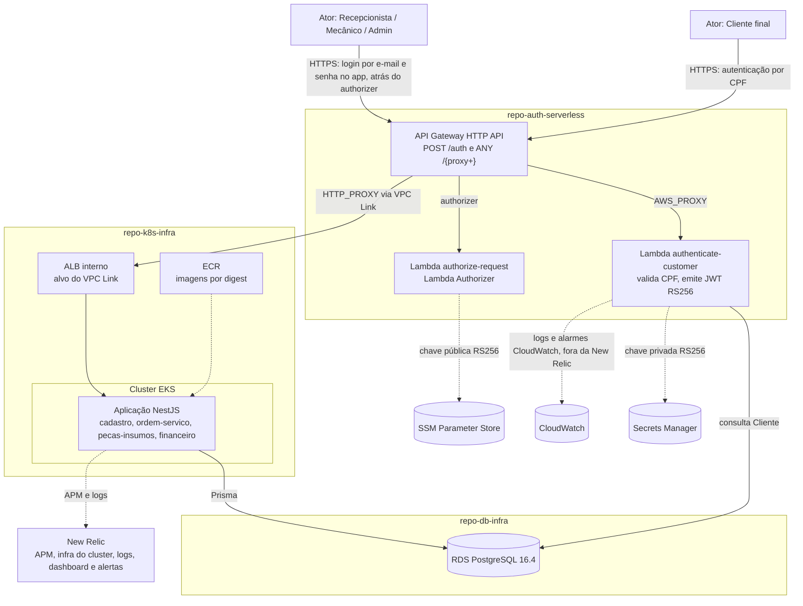
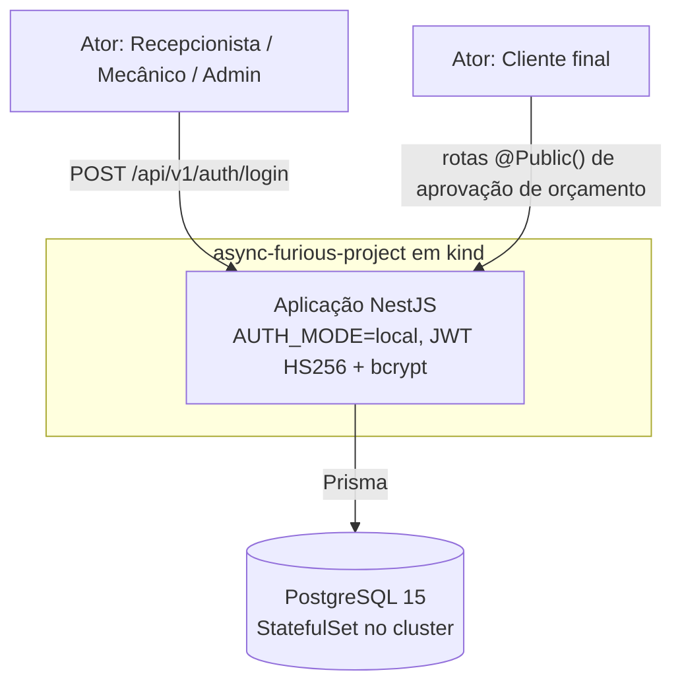

# Visão Geral da Arquitetura — Async & Furious (Fase 3)

> Duas camadas de informação: **[ATUAL]**, o que está implementado e rodando,
> e **[PENDENTE]**, o que a Fase 3 exige e ainda não tem decisão ou evidência.
> A marca `[PROPOSTA FASE 3]`, usada em versões anteriores deste documento,
> foi retirada: a arquitetura distribuída deixou de ser proposta e está
> provisionada em `hml` e `prod`.

## 1. Os quatro repositórios

A solução é dividida em quatro repositórios sob a organização
`Async-And-Furious`.

| Repositório | Papel | Estado |
|---|---|---|
| **`async-furious-project`** (este; `repo-application` nas RFCs) | Monólito NestJS com os quatro Bounded Contexts de negócio (`cadastro`, `ordem-servico`, `pecas-insumos`, `financeiro`) | **[ATUAL]** Implementado, testado, com deploy automatizado para EKS |
| **`repo-auth-serverless`** | Autenticação centralizada: valida CPF e emite JWT RS256 (`authenticate-customer`); autoriza na borda (`authorize-request`) | **[ATUAL]** Handlers implementados e testados; API Gateway, Lambdas, authorizer e VPC Link provisionados por Terraform em `infra/hml` e `infra/prod` |
| **`repo-k8s-infra`** | VPC, EKS, ECR e ALB interno via Terraform | **[ATUAL]** Módulos completos, incluindo AWS Load Balancer Controller, Metrics Server e New Relic (bundle, dashboard e alertas) |
| **`repo-db-infra`** | RDS PostgreSQL 16 via Terraform | **[ATUAL]** Módulo completo, privado nos dois ambientes, com três alarmes |

As referências a código dos satélites apontam para a branch `main` de cada um,
que já contém o que antes estava em `release/v0.1.0`.

Existe ainda um quinto repositório, `async-furious-front` (privado), que é o
frontend. Ele não faz parte da separação em quatro repositórios de backend e
não é coberto por este documento.

> **Lacuna**: as RFCs e os READMEs dos satélites citam um `HANDOFF.md` como
> lista mestra de decisões. Esse arquivo não foi encontrado em nenhuma branch
> de nenhum dos quatro repositórios. Sem ele, parte do racional só é
> verificável pelo que já foi transcrito em [`docs/rfcs/`](../rfcs/README.md).

## 2. Diagrama de componentes (C4, nível Container)

### O mesmo sistema no ambiente local

No ambiente `kind`, autenticação, autorização e persistência acontecem dentro
do mesmo processo e do mesmo cluster. Não há API Gateway, Lambda nem banco
gerenciado. É a mesma base de código: o que muda é `AUTH_MODE` e o destino do
`DATABASE_URL`. Ver
[`docs/infrastructure/kubernetes.md`](../infrastructure/kubernetes.md).

## 3. Fluxo de comunicação entre componentes

1. **Cliente → API Gateway**: requisição HTTPS chega ao HTTP API
   `tc3-auth-<env>`, único componente público do sistema
   ([RFC-003](../rfcs/RFC-003-api-gateway-eks-integration.md)).
2. **API Gateway → Lambda de autenticação**: `POST /auth` invoca
   `authenticate-customer`, que valida o CPF, confirma cliente ativo no RDS e
   emite JWT RS256 com `sub` igual a `Cliente.id`
   ([RFC-006](../rfcs/RFC-006-secrets-and-jwt.md)).
3. **API Gateway → Lambda Authorizer**: `ANY /{proxy+}` passa antes por
   `authorize-request`, que verifica assinatura, emissor, audiência e
   expiração com a chave pública do SSM.
4. **API Gateway → Aplicação**: requisição autorizada segue por VPC Link até o
   ALB interno, que a entrega aos pods registrados via `TargetGroupBinding`.
5. **Aplicação → Banco**: acesso ao RDS por Prisma, com TLS obrigatório. A
   aplicação revalida o token e reconfirma no banco que o usuário ou cliente
   continua válido.
6. **Observabilidade**: New Relic para a aplicação (APM e logs) e para o
   cluster (bundle com métricas de infraestrutura e `kube-state-metrics`), com
   dashboard e alertas por e-mail provisionados em `repo-k8s-infra`. Lambdas e
   RDS ficam em CloudWatch, com alarmes próprios. Ver
   [`docs/infrastructure/observability.md`](../infrastructure/observability.md).

## 4. Comunicação entre Bounded Contexts

A separação em quatro repositórios extrai a autenticação e a infraestrutura
para repositórios próprios. Ela não divide os quatro Bounded Contexts de
negócio (`cadastro`, `ordem-servico`, `pecas-insumos`, `financeiro`), que
permanecem dentro do monólito e continuam se comunicando em processo, via
`EmissorEventos`/`DomainEvent` (ver [`docs/ddd.md`](../ddd.md) §5). A RFC-003
registra que dividir o monólito em microsserviços é uma direção considerada,
não decidida, e que a escolha de ALB em vez de NLB existe para não exigir
retrabalho caso isso aconteça.

O único Bounded Context que passou de local para cross-processo é **Segurança
e Autenticação**: ele vivia em `src/auth/` e agora é um serviço externo que se
comunica com a aplicação por um JWT verificável com chave pública, sem
acoplamento de código. Ver a revisão do Context Map em
[`docs/domain/revisao-fase3.md`](../domain/revisao-fase3.md).

Vale a ressalva de que `src/auth/` não desapareceu: ele continua validando o
token e resolvendo identidade a cada requisição. Para o cliente, a extração
foi da emissão do token: quem emite é a Lambda. Para o staff, não: nos
ambientes AWS a própria aplicação continua emitindo o token de login, agora
em RS256 com a mesma chave privada da Lambda. Ver
[`authentication-flow.md`](./authentication-flow.md).

## 5. Documentos relacionados

- [Diagrama de Componentes detalhado](./component-diagram.md)
- [Diagrama de Implantação](./deployment-diagram.md)
- [Sequência de autenticação](./authentication-flow.md)
- [Sequência de abertura de OS](./service-order-flow.md)
- [Infraestrutura AWS](../infrastructure/aws.md)
- [API Gateway e Lambda](../infrastructure/api-gateway-lambda.md)
- [ADRs](../adr/README.md) e [RFCs](../rfcs/README.md)
