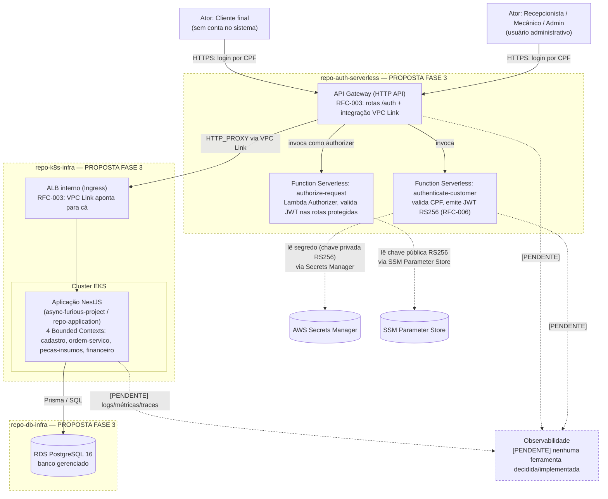
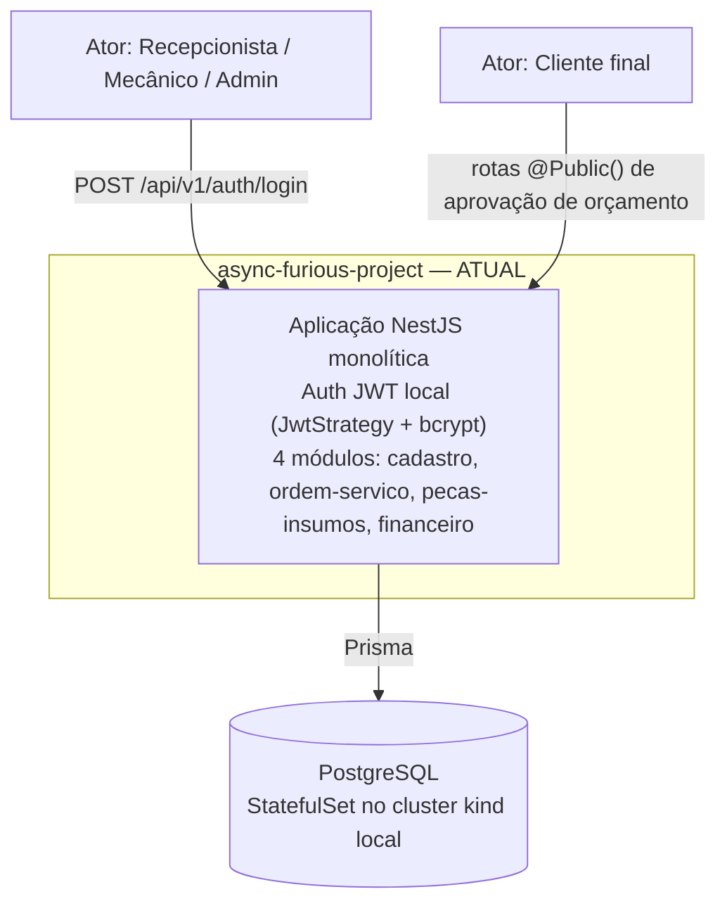

# Visão Geral da Arquitetura — Async & Furious (Fase 3)

> Este documento distingue explicitamente três camadas de informação:
> **[ATUAL]** — o que está implementado e rodando hoje neste repositório;
> **[PROPOSTA FASE 3]** — a arquitetura distribuída alvo, decidida (ADRs/RFCs
> com Status "Accepted"/"Aceita") mas **ainda não totalmente implementada**;
> **[PENDENTE]** — o que a Fase 3 exige mas ainda não tem decisão ou evidência
> no repositório. Nenhum item marcado `[PROPOSTA FASE 3]` ou `[PENDENTE]` deve
> ser lido como já funcionando em produção.

## 1. Os quatro repositórios

A solução da Fase 3 é dividida em quatro repositórios no GitHub, sob a
organização `Async-And-Furious`:

| Repositório | Papel | Estado (evidência) |
|---|---|---|
| **`async-furious-project`** (este repositório; chamado `repo-application` nas RFCs) | Monólito NestJS com os quatro Bounded Contexts de negócio (`cadastro`, `ordem-servico`, `pecas-insumos`, `financeiro`) + autenticação JWT local | **[ATUAL]** Implementado e funcional — Clean Architecture + DDD, testes, CI (`tests.yml`, `zap.yml`, `trivy.yml`), infra local via `infra/`+`k8s/` |
| **`repo-auth-serverless`** | Autenticação centralizada: valida CPF do cliente e emite JWT (`authenticate-customer`); autoriza requisições na borda (`authorize-request`, Lambda Authorizer) | **[PROPOSTA FASE 3]** Esqueleto apenas — os dois handlers retornam respostas *placeholder* (`501` / `isAuthorized: false`); nenhuma infraestrutura foi implantada (fonte: README do próprio repositório) |
| **`repo-k8s-infra`** | Provisionamento de VPC, EKS (e opcionalmente ECR) via Terraform | **[PROPOSTA FASE 3]** Esqueleto apenas — módulos-placeholder, nenhum `terraform apply` executado (fonte: README do próprio repositório) |
| **`repo-db-infra`** | Provisionamento do banco gerenciado (RDS PostgreSQL) via Terraform | **[PROPOSTA FASE 3]** Esqueleto apenas — nenhum `terraform apply` executado; módulo pendente da decisão de engine/versão, já resolvida em RFC de banco de dados (trigo) mas ainda não aplicada em código | 

Existe ainda um quinto repositório, **`async-furious-front`** (privado), que é
o frontend da aplicação. Ele **não faz parte da separação em quatro
repositórios de backend** definida para a Fase 3 e não é coberto por este
documento.

> **Lacuna**: todas as RFCs e os READMEs dos três repositórios satélite citam
> um arquivo `HANDOFF.md` como a lista mestra de decisões (ex.: "HANDOFF.md
> §5.2", "§6.1", "§20"). Esse arquivo **não foi encontrado em nenhuma branch de
> nenhum dos quatro repositórios**. `TODO`: localizar/reconstruir esse
> documento — sem ele, o racional completo de várias decisões não é
> verificável, apenas o que já foi transcrito nas RFCs trazidas para
> [`docs/rfcs/`](../rfcs/README.md).

## 2. Diagrama de componentes (C4 — nível Container/Component)

**Legenda**: bordas tracejadas = componentes da **proposta Fase 3**, ainda em
estágio de esqueleto/placeholder (sem `terraform apply`, sem deploy real).
Bordas sólidas = estado **atual**, implementado e testado.

### Estado atual (o que roda hoje, sem os componentes acima)

Hoje, autenticação, autorização e persistência acontecem **dentro do mesmo
processo NestJS**, num único namespace Kubernetes (`async-furious`), criado
localmente via `kind` + Terraform (`infra/environments/local`). Não há API
Gateway, não há função serverless, não há banco gerenciado — ver
[`docs/infrastructure/kubernetes.md`](../infrastructure/kubernetes.md) e
[`docs/infrastructure/database.md`](../infrastructure/database.md) para o
detalhamento.

## 3. Fluxo de comunicação entre componentes (proposta Fase 3)

1. **Cliente/Ator → API Gateway**: requisição HTTPS chega ao API Gateway
   (`repo-auth-serverless`, HTTP API — RFC-003 (trigo)).
2. **API Gateway → Function Serverless (auth)**: rotas `/auth/*` invocam
   `authenticate-customer`, que valida o CPF e emite um JWT assinado com
   RS256 (RFC-006 (trigo)).
3. **API Gateway → Function Serverless (authorizer)**: demais rotas passam
   primeiro pelo Lambda Authorizer `authorize-request`, que verifica a
   assinatura do JWT usando a chave pública (SSM Parameter Store).
4. **API Gateway → Aplicação (EKS)**: requisição autorizada é encaminhada via
   VPC Link para um Application Load Balancer interno (`repo-k8s-infra`),
   que roteia para os pods da aplicação NestJS no cluster EKS.
5. **Aplicação → Banco de Dados**: a aplicação acessa o RDS PostgreSQL
   (`repo-db-infra`) via Prisma, dentro da mesma VPC (rede privada).
6. **Observabilidade**: `[PENDENTE]` — nenhuma ferramenta de logs, métricas
   ou tracing foi decidida ou implementada em nenhum dos quatro repositórios
   (confirmado por busca sem resultados por termos como `prometheus`,
   `opentelemetry`, `winston`, `pino`, `cloudwatch` em `src/`, `k8s/`,
   `infra/`, `package.json`). Ver
   [`docs/infrastructure/observability.md`](../infrastructure/observability.md).

## 4. Comunicação entre Bounded Contexts

A separação em quatro repositórios da Fase 3 **extrai a autenticação e a
infraestrutura** para repositórios próprios — ela **não** divide os quatro
Bounded Contexts de negócio (`cadastro`, `ordem-servico`, `pecas-insumos`,
`financeiro`), que permanecem dentro do monólito `async-furious-project` e
continuam se comunicando **em processo**, via `EmissorEventos`/`DomainEvent`
(ver [`docs/ddd.md`](../ddd.md) §5). RFC-003 (trigo)
registra explicitamente que uma futura divisão do monólito em microsserviços
é uma direção **considerada, mas não decidida nem parte do escopo atual** —
apenas motivou a escolha de ALB/Ingress (em vez de NLB) para não exigir
retrabalho se isso vier a acontecer.

O único Bounded Context que muda de "local" para "cross-repo/cross-processo"
na proposta Fase 3 é **Segurança e Autenticação**: hoje ele vive dentro do
monólito (`src/auth/`); na proposta, passa a ser um serviço externo
(`repo-auth-serverless`) que se comunica com a aplicação por meio de um JWT
verificável (chave pública), sem acoplamento direto de código — ver revisão
do Context Map em [`docs/domain/revisao-fase3.md`](../domain/revisao-fase3.md).

## 5. Documentos relacionados

- [Diagrama de Componentes detalhado](./component-diagram.md)
- [Diagrama de Deployment](./deployment-diagram.md)
- [Sequência de autenticação](./authentication-flow.md)
- [Sequência de abertura de OS](./service-order-flow.md)
- [ADRs](../adr/README.md) — decisões permanentes de alto nível
- [RFCs](../rfcs/README.md) — decisões técnicas detalhadas
