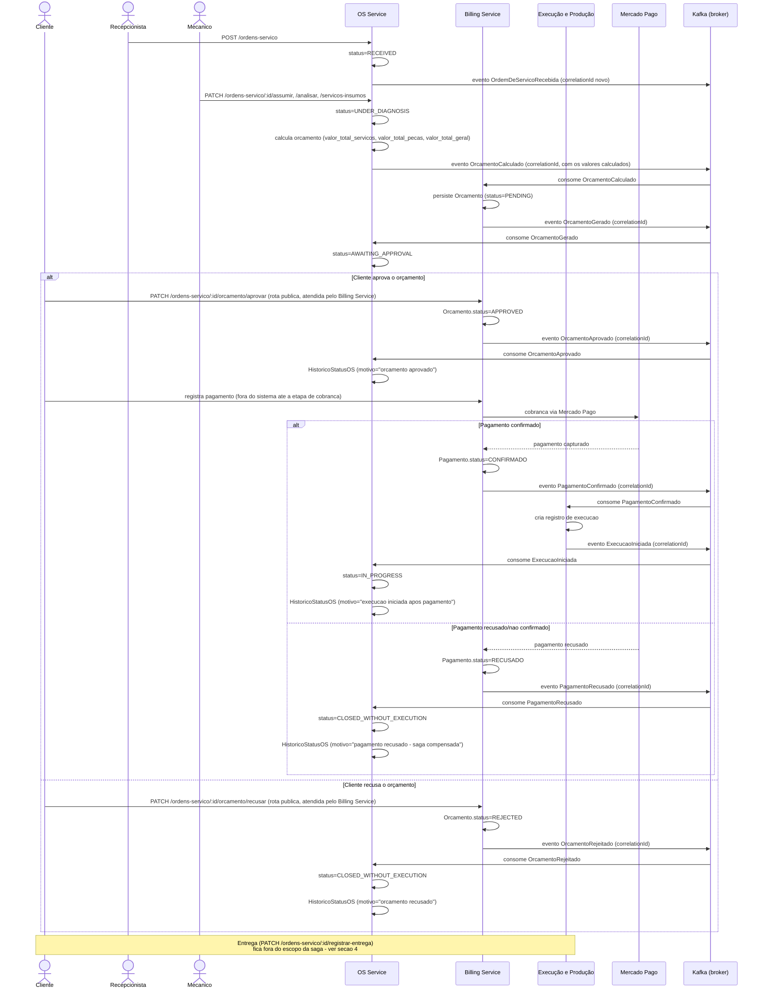

# Fluxo Distribuído da Ordem de Serviço — Saga Coreografada (Fase 4)

> Este documento detalha o desenho da Saga decidida na
> [ADR-0016](../adr/0016-saga-coreografada.md) (coreografada, sem
> orquestrador). Ele **não substitui**
> [`service-order-flow.md`](./service-order-flow.md), que continua
> descrevendo o fluxo síncrono atual dentro do monólito — este arquivo é
> novo e cobre especificamente a versão distribuída, para não conflitar com
> a Feature #307 (Divisão de Microsserviços), que também revisa o primeiro
> documento.
>
> **Alinhado com a Feature #307**: a divisão de serviços e o mapa de
> ownership já foram fechados por aquela Feature — publicados em
> `feat/I-307_DefinirDivisaoMicrosservicosOwnershipDados` (ainda não
> mesclada em `develop`), em
> [`service-boundaries.md`](./service-boundaries.md) e
> [ADR-0017](../adr/0017-divisao-microsservicos-ownership-dados.md). Este
> documento já reflete duas decisões de lá que afetam o fluxo: **o OS
> Service calcula o orçamento** e **o Billing Service gera/persiste o
> documento** e atende às rotas públicas de aprovação/recusa
> ([ADR-0011](../adr/0011-aprovacao-orcamento-api-publica.md) revisada); e
> a checagem de pagamento confirmado antes de `registrar-entrega`
> (`service-order-flow.md`) é a **mesma** cobrança feita na etapa de
> pagamento da saga, não uma segunda — ver seção 4. O formato do envelope
> de evento (campos, serialização), a topologia de tópicos e a estratégia
> de retry/DLQ estão fechados em
> [ADR-0018](../adr/0018-mensageria-contratos-eventos.md); o catálogo de
> eventos de integração consolidado está em
> [`event-catalog.md`](./event-catalog.md) — este documento mantém apenas o
> vocabulário de eventos necessário para descrever o fluxo, não repete o
> contrato de transporte.

---

## 1. Diagrama de sequência

Eventos já catalogados em [`docs/ddd.md`](../ddd.md) §5 são reaproveitados
com o mesmo nome. Os demais eventos deste fluxo (`OrcamentoCalculado`,
`PagamentoConfirmado`, `PagamentoRecusado`, `ExecucaoIniciada`), propostos
originalmente aqui como vocabulário mínimo para descrever a saga, estão
formalizados no catálogo oficial de eventos de integração — ver
[ADR-0018](../adr/0018-mensageria-contratos-eventos.md) e
[`event-catalog.md`](./event-catalog.md).

---

## 2. Mapa de responsabilidade por etapa

| Etapa | Serviço executor | Evento publicado | Evento(s) consumido(s) |
|---|---|---|---|
| Abertura da OS | OS Service | `OrdemDeServicoRecebida` | — (início da saga) |
| Diagnóstico, definição dos itens (serviços/peças) e **cálculo** do orçamento | OS Service | `OrcamentoCalculado` | — |
| Geração/persistência do documento de orçamento | Billing Service | `OrcamentoGerado` | `OrcamentoCalculado` |
| Aprovação do orçamento pelo cliente (`PATCH /ordens-servico/:id/orcamento/aprovar`, `@Public()`) | Billing Service | `OrcamentoAprovado` | — (ação direta do cliente na API do Billing Service) |
| Recusa do orçamento pelo cliente (`PATCH /ordens-servico/:id/orcamento/recusar`, `@Public()`, caminho de falha) | Billing Service | `OrcamentoRejeitado` | — (ação direta do cliente) |
| Atualização da OS para "aguardando execução" após aprovação | OS Service | — (só atualiza estado local) | `OrcamentoAprovado` |
| Cobrança/pagamento | Billing Service | `PagamentoConfirmado` ou `PagamentoRecusado` | — (integração direta com Mercado Pago, fora do broker) |
| Início da execução | Execução e Produção | `ExecucaoIniciada` | `PagamentoConfirmado` |
| Fechamento da OS por recusa de orçamento ou pagamento | OS Service | — (só atualiza estado local) | `OrcamentoRejeitado`, `PagamentoRecusado` |
| Atualização da OS para "em execução" | OS Service | — (só atualiza estado local) | `ExecucaoIniciada` |

Os eventos reaproveitados de `docs/ddd.md` §5.1 (`OrdemDeServicoRecebida`,
`OrcamentoGerado`, `OrcamentoAprovado`, `OrcamentoRejeitado`) mantêm o nome
já catalogado. Os outros quatro eventos (`OrcamentoCalculado`,
`PagamentoConfirmado`, `PagamentoRecusado`, `ExecucaoIniciada`), propostos
originalmente aqui, estão consolidados no catálogo oficial de eventos de
integração — ver [ADR-0018](../adr/0018-mensageria-contratos-eventos.md) e
[`event-catalog.md`](./event-catalog.md). `OrcamentoCalculado` carrega os
valores calculados pelo OS Service (`valor_total_servicos`,
`valor_total_pecas`, `valor_total_geral`) — é o Billing Service quem
persiste esses valores no documento de orçamento, não quem os calcula
(divisão de responsabilidade fechada pela Feature #307,
`service-boundaries.md` §1.1/§1.2).

---

## 3. Matriz `etapa → falha → compensação`

| Etapa onde a falha ocorre | Tipo de falha | Compensação | Estorno Mercado Pago? |
|---|---|---|---|
| Diagnóstico / cálculo do orçamento | OS Service não consegue calcular o orçamento (ex.: item removido ou sem preço definido entre a definição e o cálculo) | OS Service marca a OS como `CLOSED_WITHOUT_EXECUTION`, com `HistoricoStatusOS.motivo` registrando a causa. Nenhum outro serviço chegou a ser envolvido — compensação local, sem evento de compensação a propagar. | Não se aplica (nenhum pagamento existe nesta etapa) |
| Geração/persistência do documento de orçamento | Billing Service não consegue persistir o documento a partir do `OrcamentoCalculado` recebido (ex.: falha de banco no Billing Service) | Billing Service publica `OrcamentoGeracaoFalhou` (ver [ADR-0018](../adr/0018-mensageria-contratos-eventos.md) e [`event-catalog.md`](./event-catalog.md)); OS Service consome e marca a OS como `CLOSED_WITHOUT_EXECUTION` | Não se aplica |
| Aprovação do orçamento | Cliente recusa (`OrcamentoRejeitado`) | Billing Service marca `Orcamento.status=REJECTED` (estado já existente no `EstimateStatus`); OS Service consome e marca a OS como `CLOSED_WITHOUT_EXECUTION` | Não se aplica — pagamento ainda não foi cobrado |
| Cobrança/pagamento | Pagamento recusado ou não confirmado pelo Mercado Pago | Billing Service marca o `Pagamento` como recusado e publica `PagamentoRecusado`; OS Service consome e marca a OS como `CLOSED_WITHOUT_EXECUTION` | **Não** — o pagamento nunca foi capturado, não há valor a estornar |
| Início da execução (após pagamento já confirmado) | Execução e Produção não consegue iniciar (ex.: indisponibilidade de peça identificada só nesta etapa, capacidade de oficina esgotada) | Execução e Produção publica `ExecucaoInicioFalhou` (ver [ADR-0018](../adr/0018-mensageria-contratos-eventos.md) e [`event-catalog.md`](./event-catalog.md)); Billing Service consome e aciona o estorno; OS Service consome e marca a OS como `CLOSED_WITHOUT_EXECUTION` | **Sim** — o pagamento já havia sido capturado antes desta falha, então esta é a única etapa da saga em que o estorno real no Mercado Pago é acionado |

A regra geral, já fixada na ADR-0016, é: **estorno real no Mercado Pago
apenas quando a falha ocorre depois da captura do pagamento** — hoje isso
só acontece se a falha de início de execução ocorrer após o pagamento
confirmado. Qualquer falha anterior ao pagamento é compensação puramente
lógica.

---

## 4. Exclusão da entrega do escopo da saga

A entrega da OS (`PATCH /ordens-servico/:id/registrar-entrega`, status
`DELIVERED`) fica fora do fluxo coberto pela saga porque:

- É um **ato presencial**: o cliente retira o veículo fisicamente e a
  recepcionista confirma a entrega na hora, sem uma segunda etapa
  assíncrona de outro serviço para coordenar.
- Nenhum dos outros dois serviços (Billing, Execução e Produção) precisa
  reagir à entrega para manter a própria consistência — ao contrário do
  pagamento, que é pré-requisito de negócio para o Execução e Produção
  começar, a entrega não desbloqueia nem compensa nada em outro serviço.
- Se a entrega falhar ou for adiada (cliente não aparece), isso não deixa
  nenhum serviço em estado inconsistente — a OS simplesmente permanece
  `FINISHED` até a entrega efetiva, sem necessidade de compensação.

### Relação com a checagem de pagamento na entrega (resolvendo a divergência da Feature #307)

`service-order-flow.md` (seção "Integração com o contexto Financeiro (Fase
4)") define que `registrar-entrega` **valida** que existe um `Pagamento`
confirmado para a OS antes de aceitar a transição para `DELIVERED`. A
Feature #307 sinalizou essa regra como uma possível divergência em relação
à sequência de saga desta ADR — chegando a cogitar dois momentos de
cobrança — e deixou isso registrado como risco não resolvido em
[ADR-0017](../adr/0017-divisao-microsservicos-ownership-dados.md)
("Riscos") e como pendência de validação em `service-boundaries.md` §6,
item 2.

Não há dois pagamentos. Como o fluxo desta saga cobra o pagamento **antes**
do início da execução (`IN_PROGRESS`), e a execução precisa terminar
(`FINISHED`) antes de qualquer entrega ser registrada, a checagem em
`registrar-entrega` está sempre validando um pagamento que **já foi
confirmado etapas antes**, na etapa de cobrança da própria saga (seção 1).
Ela funciona como uma **trava de segurança** contra estados inconsistentes
(ex.: um bug em outro lugar do sistema permitir `FINISHED` sem pagamento
confirmado), não como um segundo gatilho de cobrança. Se o pagamento não
tivesse sido confirmado, a saga já teria compensado e encerrado a OS muito
antes de `FINISHED` existir (ver matriz da seção 3) — a checagem na entrega
nunca encontra, na prática, um pagamento pendente.

---

## 5. Rastreabilidade sem estado central

Sem orquestrador, não existe um único registro com "o estado atual da
saga". A reconstrução do que aconteceu com uma OS depende de três fontes
combinadas (detalhado na [ADR-0016](../adr/0016-saga-coreografada.md)):

1. **Trace distribuído no New Relic** — cada serviço, ao publicar ou
   consumir um evento, gera um span correlacionado; a instrumentação em si
   é responsabilidade do épico de Observabilidade da Fase 4, fora do
   escopo deste documento.
2. **`correlationId` no envelope de evento** — nasce no `OrdemDeServicoRecebida`
   e é propagado, sem alteração, por todos os eventos subsequentes da mesma
   OS (inclusive os de compensação). O formato exato do envelope está
   definido na [ADR-0018](../adr/0018-mensageria-contratos-eventos.md); este
   documento só exige que o campo exista e não seja regenerado a cada etapa.
3. **`HistoricoStatusOS.motivo`** (model já existente em
   `prisma/schema.prisma`, sem necessidade de alteração de schema) —
   continua sendo, dentro do OS Service, o registro textual de por que
   cada transição de status aconteceu, incluindo as motivadas por
   compensação de uma etapa em outro serviço.

Para reconstruir o histórico completo de uma OS que sofreu compensação, o
caminho é: localizar o `correlationId` da OS (via `HistoricoStatusOS` ou
via log), buscar o trace correspondente no New Relic e ler, em ordem, os
eventos publicados por cada serviço sob aquele `correlationId`.

---

## Referências

- [ADR-0016 — Saga coreografada](../adr/0016-saga-coreografada.md)
- [`service-order-flow.md`](./service-order-flow.md) — fluxo síncrono atual e regra pagamento→entrega (não alterado por este documento)
- [`service-boundaries.md`](./service-boundaries.md) — mapa de ownership e §6 (pendências de validação da Feature #307)
- [ADR-0017 — Divisão em três microsserviços e ownership de dados](../adr/0017-divisao-microsservicos-ownership-dados.md)
- [ADR-0011 — Aprovação de orçamento via API pública síncrona](../adr/0011-aprovacao-orcamento-api-publica.md) (revisada pela Feature #307 — rotas e serviço responsável)
- [`docs/ddd.md`](../ddd.md) §5 — catálogo de eventos de domínio existentes
- `prisma/schema.prisma` — enum `SOStatus`, `EstimateStatus`, model `HistoricoStatusOS`, model `Pagamento`
- Issue #307 — Definir Divisão de Microsserviços e Ownership de Dados
- [ADR-0018 — Kafka como broker de eventos e contrato padrão de evento](../adr/0018-mensageria-contratos-eventos.md)
- [`event-catalog.md`](./event-catalog.md) — catálogo de eventos de integração (produtor/consumidores)
- Issue #309 — Definir Mensageria e Contratos de Eventos
- Issue #337 — implementação da Saga (épico de Saga); decide se alguma falha precisa de um status distinto de `CLOSED_WITHOUT_EXECUTION`
