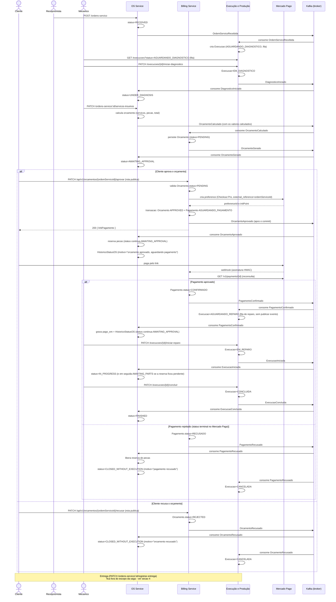

# Fluxo Distribuído da Ordem de Serviço — Saga Coreografada (Fase 4)

> Este documento detalha o desenho da Saga decidida na
> [ADR-0016](../adr/0016-saga-coreografada.md) (coreografada, sem
> orquestrador). Ele **não substitui**
> [`service-order-flow.md`](./service-order-flow.md), que continua
> descrevendo o fluxo síncrono atual dentro do monólito — este arquivo
> cobre especificamente a versão distribuída.
>
> A divisão de serviços e o mapa de ownership estão em
> [`service-boundaries.md`](./service-boundaries.md) e
> [ADR-0017](../adr/0017-divisao-microsservicos-ownership-dados.md). Duas
> decisões de lá afetam o fluxo: **o OS Service calcula o orçamento** e
> **o Billing Service gera/persiste o documento** e atende às rotas
> públicas de aprovação/recusa
> ([ADR-0011](../adr/0011-aprovacao-orcamento-api-publica.md) revisada).
> O envelope de evento, a topologia de tópicos e a estratégia de retry/DLT
> estão em [ADR-0018](../adr/0018-mensageria-contratos-eventos.md); o
> catálogo de eventos de integração está em
> [`event-catalog.md`](./event-catalog.md).
>
> **Fonte única do fluxo da Saga** (revisão de 30/09/2026). Os épicos de
> serviço (#318, #322, #329) e de Saga (#336) se alinham a este documento.
> O papel do Execução e Produção segue o enunciado (p.3): gerenciar a fila
> da OS, atualizar status durante diagnóstico e reparos e comunicar a
> finalização ao OS Service.

---

## 1. Diagrama de sequência

```mermaid
sequenceDiagram
    actor Cliente
    actor Recepcionista
    actor Mecanico
    participant OS as OS Service
    participant Billing as Billing Service
    participant Exec as Execução e Produção
    participant MP as Mercado Pago
    participant Kafka as Kafka (broker)

    Recepcionista->>OS: POST /ordens-servico
    OS->>OS: status=RECEIVED
    OS->>Kafka: OrdemServicoRecebida

    Kafka->>Exec: consome OrdemServicoRecebida
    Exec->>Exec: cria Execucao (AGUARDANDO_DIAGNOSTICO, fila)

    Mecanico->>Exec: GET /execucoes?status=AGUARDANDO_DIAGNOSTICO (fila)
    Mecanico->>Exec: PATCH /execucoes/{id}/iniciar-diagnostico
    Exec->>Exec: Execucao=EM_DIAGNOSTICO
    Exec->>Kafka: DiagnosticoIniciado

    Kafka->>OS: consome DiagnosticoIniciado
    OS->>OS: status=UNDER_DIAGNOSIS

    Mecanico->>OS: PATCH /ordens-servico/:id/servicos-insumos
    OS->>OS: calcula orcamento (servicos, pecas, total)
    OS->>Kafka: OrcamentoCalculado (com os valores calculados)

    Kafka->>Billing: consome OrcamentoCalculado
    Billing->>Billing: persiste Orcamento (status=PENDING)
    Billing->>Kafka: OrcamentoGerado

    Kafka->>OS: consome OrcamentoGerado
    OS->>OS: status=AWAITING_APPROVAL

    alt Cliente aprova o orçamento
        Cliente->>Billing: PATCH /api/v1/orcamentos/{ordemServicoId}/aprovar (rota publica)
        Billing->>Billing: valida Orcamento.status=PENDING
        Billing->>MP: cria preference (Checkout Pro, external_reference=ordemServicoId)
        MP-->>Billing: preferenceId e initPoint
        Billing->>Billing: transacao: Orcamento APPROVED + Pagamento AGUARDANDO_PAGAMENTO
        Billing->>Kafka: OrcamentoAprovado (apos o commit)
        Billing-->>Cliente: 200 { linkPagamento }

        Kafka->>OS: consome OrcamentoAprovado
        OS->>OS: reserva pecas (status continua AWAITING_APPROVAL)
        OS->>OS: HistoricoStatusOS (motivo="orcamento aprovado, aguardando pagamento")

        Cliente->>MP: paga pelo link
        MP-->>Billing: webhook (assinatura HMAC)
        Billing->>MP: GET /v1/payments/{id} (reconsulta)
        alt Pagamento aprovado
            Billing->>Billing: Pagamento.status=CONFIRMADO
            Billing->>Kafka: PagamentoConfirmado

            Kafka->>Exec: consome PagamentoConfirmado
            Exec->>Exec: Execucao=AGUARDANDO_REPARO (fila de reparo, sem publicar evento)
            Kafka->>OS: consome PagamentoConfirmado
            OS->>OS: grava pago_em + HistoricoStatusOS (status continua AWAITING_APPROVAL)

            Mecanico->>Exec: PATCH /execucoes/{id}/iniciar-reparo
            Exec->>Exec: Execucao=EM_REPARO
            Exec->>Kafka: ExecucaoIniciada

            Kafka->>OS: consome ExecucaoIniciada
            OS->>OS: status=IN_PROGRESS (e em seguida AWAITING_PARTS se a reserva ficou pendente)

            Mecanico->>Exec: PATCH /execucoes/{id}/concluir
            Exec->>Exec: Execucao=CONCLUIDA
            Exec->>Kafka: ExecucaoConcluida
            Kafka->>OS: consome ExecucaoConcluida
            OS->>OS: status=FINISHED
        else Pagamento rejeitado (status terminal no Mercado Pago)
            Billing->>Billing: Pagamento.status=RECUSADO
            Billing->>Kafka: PagamentoRecusado

            Kafka->>OS: consome PagamentoRecusado
            OS->>OS: libera reserva de pecas
            OS->>OS: status=CLOSED_WITHOUT_EXECUTION (motivo="pagamento recusado")
            Kafka->>Exec: consome PagamentoRecusado
            Exec->>Exec: Execucao=CANCELADA
        end

    else Cliente recusa o orçamento
        Cliente->>Billing: PATCH /api/v1/orcamentos/{ordemServicoId}/recusar (rota publica)
        Billing->>Billing: Orcamento.status=REJECTED
        Billing->>Kafka: OrcamentoRecusado

        Kafka->>OS: consome OrcamentoRecusado
        OS->>OS: status=CLOSED_WITHOUT_EXECUTION (motivo="orcamento recusado")
        Kafka->>Exec: consome OrcamentoRecusado
        Exec->>Exec: Execucao=CANCELADA
    end

    Note over Cliente,Exec: Entrega (PATCH /ordens-servico/:id/registrar-entrega)<br/>fica fora do escopo da saga - ver secao 4
```

**Aprovação e cobrança (detalhe da rota pública).** Todas as rotas seguem o
prefixo `/api/v1/<recurso>` (ver
[`edge-topology.md`](./edge-topology.md)). A aprovação é feita pelo Billing,
na ordem: (1) valida que o orçamento está `PENDING`; (2) cria a preference
do Checkout Pro com `external_reference=ordemServicoId` e `notification_url`;
(3) **numa transação**, grava `Orcamento=APPROVED` e
`Pagamento=AGUARDANDO_PAGAMENTO` (com `preferenceId` e `initPoint`);
(4) publica `OrcamentoAprovado` **depois do commit**; (5) responde `200` com
`{ linkPagamento }`.

- **Path param = `ordemServicoId`.** As rotas são
  `PATCH /api/v1/orcamentos/{ordemServicoId}/aprovar|recusar`: o cliente só
  conhece o id da OS, e o `Orcamento` tem `ordemServicoId` único.
- **Falha do Mercado Pago** na criação da preference: `502`, nada é gravado e
  o orçamento segue `PENDING` (o cliente pode tentar de novo).
- **Idempotência**: `Pagamento.ordemServicoId` é único; uma segunda aprovação
  do mesmo orçamento devolve o mesmo `linkPagamento`, sem criar nova
  preference.
- A consulta do pagamento fica em `GET /api/v1/pagamentos/{ordemServicoId}`
  (JWT). Não existe mais `POST /pagamentos/cobranca`: a cobrança nasce da
  aprovação.
- O webhook do Mercado Pago chega em `POST /api/v1/webhooks/mercado-pago`
  (público no Gateway, autenticado por HMAC `x-signature` + reconsulta,
  Feature #325).
- **Sem chamada REST entre serviços.** O Billing não consulta o OS Service:
  recebe os valores em `OrcamentoCalculado`. Nenhum serviço chama o outro por
  HTTP na Fase 4.

---

## 2. Mapa de responsabilidade por etapa

| Etapa | Serviço executor | Evento publicado | Evento(s) consumido(s) |
|---|---|---|---|
| Abertura da OS | OS Service | `OrdemServicoRecebida` | — (início da saga) |
| Entrada na fila de diagnóstico | Execução e Produção | — | `OrdemServicoRecebida` |
| Início do diagnóstico pelo mecânico (`PATCH /api/v1/execucoes/{id}/iniciar-diagnostico`) | Execução e Produção | `DiagnosticoIniciado` | — (ação do mecânico) |
| OS em diagnóstico | OS Service | — | `DiagnosticoIniciado` |
| Definição dos itens (serviços/peças) e **cálculo** do orçamento (`PATCH /api/v1/ordens-servico/{id}/servicos-insumos`) | OS Service | `OrcamentoCalculado` | — (ação do mecânico) |
| Geração/persistência do documento de orçamento | Billing Service | `OrcamentoGerado` | `OrcamentoCalculado` |
| OS passa a aguardar aprovação | OS Service | — | `OrcamentoGerado` |
| Aprovação pelo cliente + criação da cobrança (preference do Checkout Pro, resposta `{ linkPagamento }`) | Billing Service | `OrcamentoAprovado` | — (ação direta do cliente) |
| Recusa pelo cliente (caminho de falha) | Billing Service | `OrcamentoRecusado` | — (ação direta do cliente) |
| Reserva de peças (OS segue em `AWAITING_APPROVAL`; não reserva se a OS já estiver `CLOSED_WITHOUT_EXECUTION`) | OS Service | — | `OrcamentoAprovado` |
| Confirmação do pagamento (webhook + reconsulta) | Billing Service | `PagamentoConfirmado` ou `PagamentoRecusado` | — (webhook do Mercado Pago, fora do broker) |
| Registro do pagamento na OS (só `pago_em`; o status não muda) | OS Service | — | `PagamentoConfirmado` |
| Entrada na fila de reparo | Execução e Produção | — (não publica) | `PagamentoConfirmado` |
| Início do reparo pelo mecânico (`PATCH /api/v1/execucoes/{id}/iniciar-reparo`) | Execução e Produção | `ExecucaoIniciada` | — (ação do mecânico) |
| OS em execução | OS Service | — | `ExecucaoIniciada` |
| Conclusão da execução pelo mecânico (`PATCH /api/v1/execucoes/{id}/concluir`) | Execução e Produção | `ExecucaoConcluida` | — (ação do mecânico) |
| OS finalizada | OS Service | — | `ExecucaoConcluida` |
| Fechamento por recusa de orçamento ou pagamento | OS Service | — | `OrcamentoRecusado`, `PagamentoRecusado` |
| Cancelamento da `Execucao` (sai da fila) por recusa de orçamento ou pagamento | Execução e Produção | — | `OrcamentoRecusado`, `PagamentoRecusado` |
| Compensação por falha técnica | Os três (ver §3) | `EtapaDaSagaFalhou` | `EtapaDaSagaFalhou` |

**Fronteira do Execução e Produção (modelo híbrido mínimo).** O enunciado
(p.3) atribui ao serviço "gerenciar a fila de execução da OS", "atualizar
status durante diagnóstico e reparos" e "comunicar finalização ao OS
Service". O Execução e Produção é dono da `Execucao` e da fila, do **início
do diagnóstico**, do **início do reparo** e da **conclusão**; o mecânico age
nele por três rotas e uma listagem:

| Rota (Execução e Produção) | Efeito | Evento publicado |
|---|---|---|
| `GET /api/v1/execucoes?status=...` | Fila por status, ordenada por `createdAt` | — |
| `PATCH /api/v1/execucoes/{id}/iniciar-diagnostico` | `AGUARDANDO_DIAGNOSTICO` → `EM_DIAGNOSTICO` | `DiagnosticoIniciado` |
| `PATCH /api/v1/execucoes/{id}/iniciar-reparo` | `AGUARDANDO_REPARO` → `EM_REPARO` | `ExecucaoIniciada` (significa "mecânico iniciou o reparo") |
| `PATCH /api/v1/execucoes/{id}/concluir` | `EM_REPARO` → `CONCLUIDA` | `ExecucaoConcluida` |

Ciclo da `Execucao`: `AGUARDANDO_DIAGNOSTICO` → `EM_DIAGNOSTICO` →
`AGUARDANDO_REPARO` → `EM_REPARO` → `CONCLUIDA`; `CANCELADA` só a partir de
`AGUARDANDO_DIAGNOSTICO`, `EM_DIAGNOSTICO` ou `AGUARDANDO_REPARO` (reparo
iniciado não é cancelado — ver §3). A transição `EM_DIAGNOSTICO` →
`AGUARDANDO_REPARO` é feita por `PagamentoConfirmado` (sem publicar nada),
e `CANCELADA` por `OrcamentoRecusado`, `PagamentoRecusado` ou
`EtapaDaSagaFalhou`.

**Migração de rotas do OS Service.** `assumir` e `analisar` saem do OS
Service e viram `iniciar-diagnostico`; `finalizar-execucao` sai e vira
`concluir`. **Ficam no OS Service**: `PATCH
/api/v1/ordens-servico/{id}/servicos-insumos` (listar serviços/peças e
calcular o orçamento, que dependem de `Servico` e `Peca`, que são dele) e
`registrar-entrega`. O OS Service exige a OS em `UNDER_DIAGNOSIS` para
aceitar `servicos-insumos`; se `DiagnosticoIniciado` ainda não foi
processado, a rota responde erro de estado e o mecânico repete a chamada.

A Fase 4 não tem chamada REST entre os três serviços: o Billing recebe os
valores em `OrcamentoCalculado`, e o Execução e Produção só reage a eventos
(`OrdemServicoRecebida`, `PagamentoConfirmado`, `OrcamentoRecusado`,
`PagamentoRecusado`, `EtapaDaSagaFalhou`). Ficam **fora** da Fase 4: pausa
por falta de peça no Execução, rejeição de apontamento e reposição — a
espera por peça é tratada pelo status `AWAITING_PARTS` do OS Service, que já
existe.

**Estoque.** O estoque é do OS Service. A reserva acontece quando ele
consome `OrcamentoAprovado` (comportamento atual de
`VerificarNecessidadePecasHandler`), mas **a OS não vai mais para
`IN_PROGRESS` ao reservar**: quem leva a OS a `IN_PROGRESS` é
`ExecucaoIniciada` (agora: "o mecânico iniciou o reparo"). Se a reserva
ficar pendente (peça sem estoque, pedido ao fornecedor), a OS faz duas
transições ao receber `ExecucaoIniciada` — `AWAITING_APPROVAL → IN_PROGRESS`
e logo `IN_PROGRESS → AWAITING_PARTS` — e volta a `IN_PROGRESS` quando as
peças chegam (transições que a máquina de estados já permite; não existe
`AWAITING_APPROVAL → AWAITING_PARTS` direto). O Execução e Produção não precisa conhecer estoque.

**Status durante o pagamento.** A OS fica em `AWAITING_APPROVAL` da geração
do orçamento até `ExecucaoIniciada`. Não há status novo: "aprovado e
aguardando pagamento" é distinguido pelo `HistoricoStatusOS`. Custo aceito:
o tempo médio em `AWAITING_APPROVAL` passa a somar a espera de aprovação, a
de pagamento e a **espera na fila de reparo** (a OS já paga aguarda o
mecânico chamar `iniciar-reparo`).

**`pago_em` na OS.** Como o reparo agora começa por ação do mecânico, uma OS
já paga pode ficar mais de 48 h em `AWAITING_APPROVAL` esperando na fila, e
o detector de OS parada a encerraria e estornaria (§3). Para evitar isso, o
OS Service consome `PagamentoConfirmado` **só para gravar `pago_em`**
(coluna `nullable` em `OrdemServico`, sem mudar o status) e uma linha no
`HistoricoStatusOS` (motivo "pagamento confirmado"). O detector só considera
OS em `AWAITING_APPROVAL` com `pago_em` nulo. Isso **não** devolve ao OS
Service o `Pagamento` (continua do Billing); `pago_em` é só um marcador local
derivado do evento. Se a OS já estiver `CLOSED_WITHOUT_EXECUTION`, o evento é
ignorado (ack, com log).

**Pagamento pendente.** O Billing só publica `PagamentoRecusado` para
status terminal no Mercado Pago (`rejected`, `cancelled`). Pagamento
`pending`/`in_process` não gera evento; se o cliente nunca pagar (`pago_em`
nulo), o detector de OS parada encerra a OS (ver §3).

**Falha no consumidor.** Como cada serviço processa o evento sem garantia de
ordem entre tópicos, o consumidor classifica a falha em três casos
(retentável, ignorar com log, erro de negócio sem retry) — regra em
[ADR-0018](../adr/0018-mensageria-contratos-eventos.md), seção "Classificação
de falha no consumidor". Efeitos já visíveis no fluxo: `OrcamentoAprovado`
com a OS já `CLOSED_WITHOUT_EXECUTION` **não reserva** peças; o Billing
**ignora** um `OrcamentoCalculado` repetido depois da aprovação (não lança
`DomainException`); `DiagnosticoIniciado` com a OS já em `UNDER_DIAGNOSIS`
ou além é ignorado (ack, com log); `ExecucaoConcluida` com a OS em
`AWAITING_PARTS` (que só vai para `IN_PROGRESS`, nunca direto para
`FINISHED`) não é retentado: o OS Service registra o motivo no
`HistoricoStatusOS` e publica `EtapaDaSagaFalhou` (`etapa=reparo`), caminho
manual.

---

## 3. Matriz `etapa → falha → compensação`

Dois tipos de falha:

- **Recusa de negócio** — resultado válido, com evento próprio:
  `OrcamentoRecusado`, `PagamentoRecusado`.
- **Falha técnica** — exceção que esgotou o retry (DLT) ou OS parada além
  do prazo (detector). Vira sempre **um único evento**,
  `EtapaDaSagaFalhou`, com o campo `etapa` dizendo onde parou (ver
  [ADR-0018](../adr/0018-mensageria-contratos-eventos.md)).

| Etapa | Falha | Evento | Compensação | Estorno MP? |
|---|---|---|---|---|
| Diagnóstico | Falha técnica ao processar `OrdemServicoRecebida` (Execução) ou `DiagnosticoIniciado` (OS) | `EtapaDaSagaFalhou` (`etapa=diagnostico`) | OS fecha a OS (`CLOSED_WITHOUT_EXECUTION`) se estiver em `RECEIVED`/`UNDER_DIAGNOSIS`; Execução cancela a `Execucao` | Não |
| Cálculo/geração do orçamento | Falha técnica ao processar `OrcamentoCalculado` (Billing) ou `OrcamentoGerado` (OS) | `EtapaDaSagaFalhou` (`etapa=orcamento`) | OS fecha a OS (`CLOSED_WITHOUT_EXECUTION`); Execução cancela a `Execucao` | Não |
| Aprovação | Cliente recusa | `OrcamentoRecusado` | OS fecha a OS; Execução cancela a `Execucao` | Não |
| Aprovação | Cliente não responde no prazo | `EtapaDaSagaFalhou` (`etapa=aprovacao-pagamento`), pelo detector | OS fecha a OS; Execução cancela a `Execucao` | Não |
| Pagamento | Mercado Pago rejeita (terminal) | `PagamentoRecusado` | OS **libera a reserva de peças** e fecha a OS; Execução cancela a `Execucao` | Não — nada foi capturado |
| Pagamento | Cliente não paga no prazo (`pago_em` nulo) | `EtapaDaSagaFalhou` (`etapa=aprovacao-pagamento`), pelo detector | OS libera a reserva e fecha a OS; Execução cancela a `Execucao`; Billing estorna **se** houver pagamento confirmado | Só se capturado |
| Início da execução | Falha técnica do Execução ao processar `PagamentoConfirmado` (a OS paga nunca entrou na fila de reparo) | `EtapaDaSagaFalhou` (`etapa=inicio-execucao`) | Billing estorna; OS libera a reserva e fecha a OS (ainda está em `AWAITING_APPROVAL`); Execução cancela a `Execucao` | **Sim** |
| Reparo | Falha técnica do OS ao processar `ExecucaoIniciada` ou `ExecucaoConcluida` | `EtapaDaSagaFalhou` (`etapa=reparo`) | **Nenhuma compensação automática** — o mecânico já iniciou (ou concluiu) o reparo; a `Execucao` segue seu ciclo, OS registra o motivo e o caso é tratado manualmente (replay do offset) | Não |

**Evento original → `etapa` (DLT).** O consumidor da DLT de cada serviço
deriva a `etapa` do `eventType` da mensagem que esgotou o retry, pela tabela
abaixo (o `eventTypeOriginal` do payload é esse mesmo `eventType`):

| `eventType` da mensagem que falhou | Serviço que falhou ao processar | `etapa` |
|---|---|---|
| `OrdemServicoRecebida` | Execução e Produção | `diagnostico` |
| `DiagnosticoIniciado` | OS Service | `diagnostico` |
| `OrcamentoCalculado` | Billing Service | `orcamento` |
| `OrcamentoGerado` | OS Service | `orcamento` |
| `OrcamentoAprovado` | OS Service (reserva de peças) | `aprovacao-pagamento` |
| `OrcamentoRecusado`, `PagamentoRecusado` | OS Service ou Execução e Produção | `aprovacao-pagamento` |
| `PagamentoConfirmado` | Execução e Produção | `inicio-execucao` |
| `PagamentoConfirmado` | OS Service (gravar `pago_em`) | **não gera evento** — o pagamento é válido e o reparo pode já ter começado; fica na DLT para replay manual |
| `ExecucaoIniciada` | OS Service | `reparo` |
| `ExecucaoConcluida` | OS Service | `reparo` |
| `EtapaDaSagaFalhou` | qualquer | **não gera novo evento** (evita laço); fica na DLT para replay manual |

O detector de OS parada publica `etapa=aprovacao-pagamento` com
`eventTypeOriginal = null` (não há mensagem original) e
`servicoOrigem = "os-service"`.

**Regras de aplicação** (valem para todos os consumidores):

- O OS Service só fecha a OS se ela estiver em `RECEIVED`,
  `UNDER_DIAGNOSIS` ou `AWAITING_APPROVAL` — exatamente as origens que a
  máquina de estados já aceita para `CLOSED_WITHOUT_EXECUTION`. Em
  `IN_PROGRESS`/`AWAITING_PARTS` ele só registra o motivo no
  `HistoricoStatusOS`. **Nenhum guard de transição precisa mudar.**
- O Execução e Produção cancela a `Execucao` (`CANCELADA`) em toda
  `EtapaDaSagaFalhou`, exceto `reparo`, e em `OrcamentoRecusado` e
  `PagamentoRecusado` — **somente** se a `Execucao` estiver em
  `AGUARDANDO_DIAGNOSTICO`, `EM_DIAGNOSTICO` ou `AGUARDANDO_REPARO`. Em
  `EM_REPARO` ou estado terminal, ignora (reparo iniciado não é cancelado).
- O Billing só estorna se existir `Pagamento` confirmado para a OS **e** a
  etapa for `aprovacao-pagamento` ou `inicio-execucao`. Ao processar
  qualquer `EtapaDaSagaFalhou` dessas etapas, o Billing marca o `Pagamento`
  da OS como `ESTORNADO` (se estava confirmado e o refund foi chamado) ou
  `CANCELADO` (se ainda não havia captura).
- **Pagamento atrasado.** Se a confirmação do Mercado Pago chegar para um
  `Pagamento` já `CANCELADO` (OS fechada pelo detector ou por falha
  técnica antes de o cliente pagar), o Billing **estorna na hora** e não
  publica `PagamentoConfirmado`. Para reduzir esse caso, a preference é
  criada com `expiration_date_to` igual ao prazo do detector.
- Toda compensação é idempotente: receber o mesmo `EtapaDaSagaFalhou` duas
  vezes não estorna nem libera reserva duas vezes.
- **Liberar reserva de peças** é operação nova no `pecas-insumos` (hoje
  `reserva-estoque.repository.ts` não tem). É a compensação de negócio
  mais fácil de demonstrar no vídeo: aprovar o orçamento e recusar o
  pagamento no sandbox.

**Detector de OS parada.** Código do OS Service, executado como **CronJob do
Kubernetes** (uma execução por vez, sem duplicata mesmo com HPA nos pods do
serviço). O prazo é configurável por variável de ambiente, padrão **48 h**;
na demonstração, usa-se alguns minutos. Na Fase 4 ele cobre **apenas** OS em
`AWAITING_APPROVAL` além do prazo **com `pago_em` nulo** (cliente que não
aprova ou não paga) e publica `EtapaDaSagaFalhou` com
`etapa=aprovacao-pagamento`, `eventTypeOriginal = null` e
`servicoOrigem = "os-service"` (não há mensagem original a citar). OS já
paga (`pago_em` preenchido) esperando o mecânico na fila de reparo **não é
varrida**: a espera nessa fila é operacional, não uma saga parada. OS
paradas em `RECEIVED`/`UNDER_DIAGNOSIS` não são varridas (a matriz não prevê
`etapa=orcamento` nem `etapa=diagnostico` pelo detector; essas etapas só
vêm da DLT).

**Origem da falha e assinaturas.** Cada serviço assina os tópicos dos outros
dois (tabela "Assinaturas por serviço" em
[`event-catalog.md`](./event-catalog.md)), não o próprio. Quando o serviço
que publica `EtapaDaSagaFalhou` também precisa compensar (ex.: o OS Service
fechando a OS por falha na própria DLT ou pelo detector, ou o Execução e
Produção cancelando a própria `Execucao` por falha na sua DLT), ele aplica a
compensação local no mesmo ato em que publica o evento.

A regra geral, fixada na ADR-0016, continua: **estorno real no Mercado Pago
apenas quando há pagamento capturado e a execução ainda não começou**.
Qualquer falha anterior ao pagamento é compensação puramente lógica.

---

## 4. Exclusão da entrega do escopo da saga

A entrega da OS (`PATCH /ordens-servico/:id/registrar-entrega`, status
`DELIVERED`) fica fora do fluxo coberto pela saga porque:

- É um **ato presencial**: o cliente retira o veículo fisicamente e a
  recepcionista confirma a entrega na hora, sem uma segunda etapa
  assíncrona de outro serviço para coordenar.
- Nenhum dos outros dois serviços (Billing, Execução e Produção) precisa
  reagir à entrega para manter a própria consistência — ao contrário do
  pagamento, que é pré-requisito de negócio para o início do reparo no
  Execução e Produção, a entrega não desbloqueia nem compensa nada em outro
  serviço.
- Se a entrega falhar ou for adiada (cliente não aparece), isso não deixa
  nenhum serviço em estado inconsistente — a OS simplesmente permanece
  `FINISHED` até a entrega efetiva, sem necessidade de compensação.

### Sem checagem de pagamento na entrega

A decisão de 22/09/2026 previa que `registrar-entrega` validasse a
existência de um `Pagamento` confirmado antes de aceitar `DELIVERED`. **Essa
checagem foi cortada**:

- O `Pagamento` pertence ao Billing Service; o OS Service não o tem (guarda
  só o marcador `pago_em`, usado pelo detector, §2), e consultá-lo exigiria
  chamada REST entre serviços (descartada na Fase 4).
- `FINISHED` só é alcançável depois de `ExecucaoConcluida`, que só existe
  depois de `iniciar-reparo` (`ExecucaoIniciada`), que só é possível depois de
  `PagamentoConfirmado`. A checagem seria sempre verdadeira.

Existe **um único pagamento**, cobrado na etapa de aprovação. O OS Service
aceita `registrar-entrega` para qualquer OS em `FINISHED`.

---

## 5. Rastreabilidade sem estado central

Sem orquestrador, não existe um único registro com "o estado atual da
saga". A reconstrução do que aconteceu com uma OS depende de três fontes
combinadas (detalhado na [ADR-0016](../adr/0016-saga-coreografada.md)):

1. **Trace distribuído no New Relic** — cada serviço, ao publicar ou
   consumir um evento, gera um span correlacionado; a instrumentação em si
   é responsabilidade do épico de Observabilidade da Fase 4.
2. **`correlationId` no envelope de evento** — **é sempre o
   `ordemServicoId`**, em todos os eventos da saga (inclusive os de
   compensação). A regra é determinística: qualquer serviço calcula o
   `correlationId` a partir da OS, sem depender de ter recebido o
   `OrdemServicoRecebida`. O `x-correlation-id` HTTP (Authorizer, Gateway,
   Pino) continua existindo, mas é só o **id de requisição** nos logs e não
   se confunde com o `correlationId` da saga. O formato exato do envelope
   está na [ADR-0018](../adr/0018-mensageria-contratos-eventos.md).
3. **`HistoricoStatusOS.motivo`** (model já existente em
   `prisma/schema.prisma`) — continua sendo, dentro do OS Service, o
   registro textual de por que cada transição de status aconteceu,
   incluindo as motivadas por compensação. A gravação fica no
   `OrdemServicoRepository.update` sempre que o status muda (ver
   [`persistence-model.md`](./persistence-model.md) §5), cobrindo todos os
   caminhos de escrita.

Para reconstruir o histórico completo de uma OS que sofreu compensação, o
caminho é: partir do `ordemServicoId` (que é o `correlationId`), buscar o
trace correspondente no New Relic e ler, em ordem, os eventos publicados por
cada serviço sob aquele identificador.

---

## Referências

- [ADR-0016 — Saga coreografada](../adr/0016-saga-coreografada.md)
- [ADR-0018 — Kafka como broker de eventos e contrato padrão de evento](../adr/0018-mensageria-contratos-eventos.md)
- [`event-catalog.md`](./event-catalog.md) — catálogo de eventos de integração (produtor/consumidores)
- [`service-order-flow.md`](./service-order-flow.md) — fluxo síncrono atual (monólito)
- [`edge-topology.md`](./edge-topology.md) — rotas, roteamento no ALB e rotas públicas
- [`service-boundaries.md`](./service-boundaries.md) — mapa de ownership
- [ADR-0017 — Divisão em três microsserviços e ownership de dados](../adr/0017-divisao-microsservicos-ownership-dados.md)
- [ADR-0011 — Aprovação de orçamento via API pública síncrona](../adr/0011-aprovacao-orcamento-api-publica.md)
- `prisma/schema.prisma` — enum `SOStatus`, `EstimateStatus`, model `HistoricoStatusOS`, model `Pagamento`
- `src/modules/ordem-servico/domain/services/status-transition.service.ts` — transições permitidas
- Issues #308 (Saga), #309 (Mensageria), #325 (Mercado Pago), #337/#338 (implementação da Saga)
