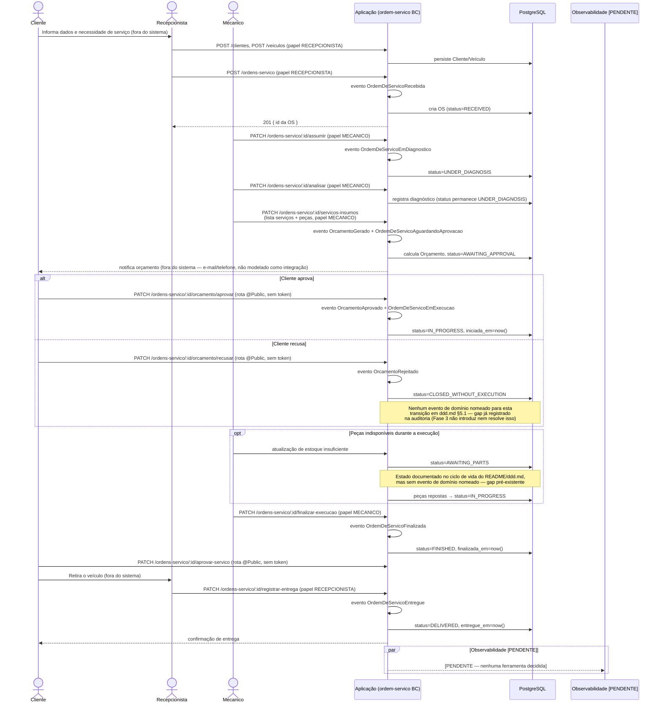

# Sequência de Abertura e Acompanhamento da Ordem de Serviço

> Este fluxo **já existia** documentado em três artefatos independentes e
> consistentes entre si: o Domain Storytelling
> ([`domain-storytelling.suggestion.vic.png`](../domain-storytelling/suggestions/domain-storytelling.suggestion.vic.png)),
> a sequência UML
> ([`os-flow.suggestion.vic.mmd`](../others/suggestions/os-flow.suggestion.vic.mmd))
> e o relatório E2E real
> ([`relatorio-e2e-orcamento-curl.md`](../reports/relatorio-e2e-orcamento-curl.md)).
> Este documento **formaliza** essa sequência já existente, anotando-a com
> endpoints reais, papéis exigidos, estados (`SOStatus`) e eventos de domínio
> documentados em [`ddd.md`](../ddd.md) §5.1 — sem inventar eventos ou passos
> novos. Nenhuma parte deste fluxo muda entre o estado atual e a proposta
> Fase 3, exceto o mecanismo de autenticação/autorização de borda (ver
> [authentication-flow.md](./authentication-flow.md)).

## Integração com o contexto Financeiro

`POST /pagamentos/registrar` (autenticado, qualquer papel) registra um
pagamento e, segundo o README, "dispara a entrega da OS". A relação exata
entre esse endpoint e `PATCH /ordens-servico/:id/registrar-entrega` **não
estava detalhada em nenhum artefato de modelagem** (nem Domain Storytelling,
nem Event Storming, nem diagrama de sequência dedicado ao financeiro) — gap
pré-existente, não introduzido nem resolvido pela Fase 3. A definição abaixo
fecha esse gap, como parte da Feature #307 (Fase 4).

### Integração com o contexto Financeiro (Fase 4) {#integração-com-o-contexto-financeiro-fase-4}

**Decidido (22/09/2026): pagamento aprovado é pré-requisito para o registro
de entrega — não é o gatilho automático dela.**

- "Entrega" aqui é a devolução do veículo ao cliente, ato presencial
  registrado por `PATCH /ordens-servico/:id/registrar-entrega` (papel
  RECEPCIONISTA), como já mostra o diagrama acima.
- O endpoint continua sendo acionado manualmente pelo Recepcionista — o
  pagamento **não** dispara a transição para `DELIVERED` sozinho.
- O que muda: `registrar-entrega` passa a **validar** que existe um
  `Pagamento` já registrado (e aprovado) para aquela `OrdemServico` antes de
  aceitar a transição. Sem pagamento confirmado, a rota rejeita a entrega.
- Isso substitui a leitura antiga de "dispara a entrega" (implicava
  automação) por uma checagem de pré-condição — mais barato de implementar
  (nenhum novo evento acionando o outro serviço) e mais alinhado ao fato de
  que a entrega continua sendo um ato presencial, fora do sistema, apenas
  registrado pela API.
- Consequência para a divisão em microsserviços (`service-boundaries.md`):
  como `Pagamento` migra para o Billing Service, essa validação deixa de ser
  uma consulta local ao mesmo banco e passa a depender de informação vinda
  de outro serviço — o mecanismo exato (consulta síncrona ao Billing Service,
  ou leitura de um evento `PagamentoConfirmado` já consumido e refletido no OS
  Service) é **decisão de implementação fora do escopo desta Feature**,
  tratada nas Features de Mensageria (#309) e de extração do Financeiro
  (#330).

> **Relação com a Saga (resolvida pela Feature #308 / ADR-0016):** a
> sequência de Saga (`fase4-decisoes-epico1.md`, F2/2.2) é "abrir OS →
> orçamento → aprovação → **pagamento** → execução iniciada" — o pagamento
> acontece **antes** de `IN_PROGRESS`, logo após a aprovação do orçamento.
> Existe **um único pagamento**, cobrado nessa etapa da Saga; não há sinal +
> saldo nem segundo momento de cobrança. A validação em `registrar-entrega`
> definida acima continua valendo, mas como **trava de segurança**: no fluxo
> normal ela já está sempre satisfeita, porque nenhuma OS chega a
> `FINISHED` sem ter passado pelo pagamento. Detalhes em
> [ADR-0016](../adr/0016-saga-coreografada.md) e
> [`saga-flow.md` §4](./saga-flow.md).

## Erros e fluxos alternativos cobertos pela API (evidência: tabela de rotas do README)

| Situação | Comportamento |
|---|---|
| Papel sem permissão (ex.: RECEPCIONISTA tentando `finalizar-execucao`) | 403 Forbidden (`RolesGuard`) |
| Token ausente/expirado/inválido em rota não-`@Public()` | 401 Unauthorized (`JwtAuthGuard`) |
| Orçamento sem `valor_total_servicos > 0` | Validação de negócio rejeita a geração do orçamento (regra citada na síntese técnica consolidada; não confirmada linha a linha nesta auditoria — `TODO` verificar no use case) |

## Consulta de status

`GET /ordens-servico/:id/status` e `GET /ordens-servico/tempo-medio` (papel
ADMIN) são consultas, não alteram o fluxo principal — incluídas para
completude do mapeamento endpoint↔estado.

## Relação com a arquitetura da Fase 3

Este fluxo roda **inteiramente dentro do Bounded Context `ordem-servico`, no
mesmo monólito**, hoje e na arquitetura da Fase 3 — a separação em quatro
repositórios não o altera. A única mudança é *como* a requisição chega até a
aplicação (via API Gateway + Lambda Authorizer, em vez de acesso direto) —
ver [authentication-flow.md](./authentication-flow.md) e
[overview.md §4](./overview.md#4-comunicação-entre-bounded-contexts).

## Relação com a arquitetura da Fase 4

Deixa de ser verdade que este fluxo roda "inteiramente" num único processo:
com a divisão em microsserviços (`docs/architecture/service-boundaries.md`),
`Orcamento` e `Pagamento` passam a viver no Billing Service, em banco
separado do OS Service. As transições `AWAITING_APPROVAL` → aprovação/recusa
do orçamento e a validação de pagamento antes de `registrar-entrega` (seção
acima) passam a cruzar a fronteira de serviço — via evento (Saga
coreografada) ou consulta síncrona, decisão que fica para as Features de
Mensageria (#309) e de extração do Financeiro (#330). O diagrama de sequência
acima continua correto como fluxo de **negócio**; deixa de ser preciso como
fluxo de **um único processo** a partir da Fase 4.
