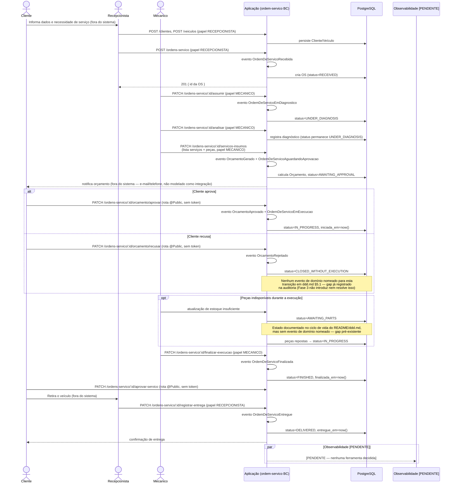

# Sequência de Abertura e Acompanhamento da Ordem de Serviço

> Este fluxo **já existia** documentado em três artefatos independentes e
> consistentes entre si: o Domain Storytelling
> ([`domain-storytelling.suggestion.vic.png`](../domain-storytelling/suggestions/domain-storytelling.suggestion.vic.png)),
> a sequência UML
> ([`os-flow.suggestion.vic.mmd`](../others/suggestions/os-flow.suggestion.vic.mmd))
> e o relatório E2E real
> ([`relatorio-e2e-orcamento-curl.md`](../reports/relatorio-e2e-orcamento-curl.md)).
> Este documento **formaliza** essa sequência já existente, anotando-a com
> endpoints reais, papéis exigidos, estados (`SOStatus`) e eventos de domínio
> documentados em [`ddd.md`](../ddd.md) §5.1 — sem inventar eventos ou passos
> novos. Nenhuma parte deste fluxo muda entre o estado atual e a proposta
> Fase 3, exceto o mecanismo de autenticação/autorização de borda (ver
> [authentication-flow.md](./authentication-flow.md)).

```mermaid
sequenceDiagram
    actor Cliente
    actor Recepcionista
    actor Mecanico
    participant API as Aplicação (ordem-servico BC)
    participant DB as PostgreSQL
    participant Obs as Observabilidade [PENDENTE]

    Cliente->>Recepcionista: Informa dados e necessidade de serviço (fora do sistema)
    Recepcionista->>API: POST /clientes, POST /veiculos (papel RECEPCIONISTA)
    API->>DB: persiste Cliente/Veículo
    Recepcionista->>API: POST /ordens-servico (papel RECEPCIONISTA)
    API->>API: evento OrdemDeServicoRecebida
    API->>DB: cria OS (status=RECEIVED)
    API-->>Recepcionista: 201 { id da OS }

    Mecanico->>API: PATCH /ordens-servico/:id/assumir (papel MECANICO)
    API->>API: evento OrdemDeServicoEmDiagnostico
    API->>DB: status=UNDER_DIAGNOSIS
    Mecanico->>API: PATCH /ordens-servico/:id/analisar (papel MECANICO)
    API->>DB: registra diagnóstico (status permanece UNDER_DIAGNOSIS)

    Mecanico->>API: PATCH /ordens-servico/:id/servicos-insumos<br/>(lista serviços + peças, papel MECANICO)
    API->>API: evento OrcamentoGerado + OrdemDeServicoAguardandoAprovacao
    API->>DB: calcula Orçamento, status=AWAITING_APPROVAL
    API-->>Cliente: notifica orçamento (fora do sistema — e-mail/telefone, não modelado como integração)

    alt Cliente aprova
        Cliente->>API: PATCH /ordens-servico/:id/orcamento/aprovar (rota @Public, sem token)
        API->>API: evento OrcamentoAprovado + OrdemDeServicoEmExecucao
        API->>DB: status=IN_PROGRESS, iniciada_em=now()
    else Cliente recusa
        Cliente->>API: PATCH /ordens-servico/:id/orcamento/recusar (rota @Public, sem token)
        API->>API: evento OrcamentoRejeitado
        API->>DB: status=CLOSED_WITHOUT_EXECUTION
        Note over API,DB: Nenhum evento de domínio nomeado para esta<br/>transição em ddd.md §5.1 — gap já registrado<br/>na auditoria (Fase 3 não introduz nem resolve isso)
    end

    opt Peças indisponíveis durante a execução
        Mecanico->>API: atualização de estoque insuficiente
        API->>DB: status=AWAITING_PARTS
        Note over API,DB: Estado documentado no ciclo de vida do README/ddd.md,<br/>mas sem evento de domínio nomeado — gap pré-existente
        API->>DB: peças repostas → status=IN_PROGRESS
    end

    Mecanico->>API: PATCH /ordens-servico/:id/finalizar-execucao (papel MECANICO)
    API->>API: evento OrdemDeServicoFinalizada
    API->>DB: status=FINISHED, finalizada_em=now()

    Cliente->>API: PATCH /ordens-servico/:id/aprovar-servico (rota @Public, sem token)

    Cliente->>Recepcionista: Retira o veículo (fora do sistema)
    Recepcionista->>API: PATCH /ordens-servico/:id/registrar-entrega (papel RECEPCIONISTA)
    API->>API: evento OrdemDeServicoEntregue
    API->>DB: status=DELIVERED, entregue_em=now()
    API-->>Cliente: confirmação de entrega

    par Observabilidade [PENDENTE]
        API-->>Obs: [PENDENTE — nenhuma ferramenta decidida]
    end
```

## Integração com o contexto Financeiro

`POST /pagamentos/registrar` (autenticado, qualquer papel) registra um
pagamento e, segundo o README, "dispara a entrega da OS". A relação exata
entre esse endpoint e `PATCH /ordens-servico/:id/registrar-entrega` **não
estava detalhada em nenhum artefato de modelagem** (nem Domain Storytelling,
nem Event Storming, nem diagrama de sequência dedicado ao financeiro) — gap
pré-existente, não introduzido nem resolvido pela Fase 3. A definição abaixo
fecha esse gap, como parte da Feature #307 (Fase 4).

### Integração com o contexto Financeiro (Fase 4) {#integração-com-o-contexto-financeiro-fase-4}

**Decidido na revisão de 30/09/2026: não há checagem de pagamento em
`registrar-entrega`.** A decisão de 22/09/2026 (validar um `Pagamento`
confirmado antes de aceitar `DELIVERED`) foi **cortada**.

- "Entrega" aqui é a devolução do veículo ao cliente, ato presencial
  registrado por `PATCH /ordens-servico/:id/registrar-entrega` (papel
  RECEPCIONISTA), como já mostra o diagrama acima. Continua acionado
  manualmente pelo Recepcionista; o pagamento **não** dispara a transição
  para `DELIVERED`.
- Na Fase 4 o `Pagamento` pertence ao Billing Service; o OS Service não o
  tem e guarda só o marcador `pago_em` (usado pelo detector de OS parada,
  [`saga-flow.md` §2](./saga-flow.md)). Validar a entrega exigiria uma chamada REST entre serviços, que a
  Fase 4 não tem: toda a coordenação é por evento.
- A checagem seria sempre verdadeira: a OS só chega a `FINISHED` depois de
  `ExecucaoConcluida`, que só existe depois de `iniciar-reparo`
  (`ExecucaoIniciada`), que só é possível depois de `PagamentoConfirmado`. O OS Service aceita `registrar-entrega`
  para qualquer OS em `FINISHED`.
- Existe **um único pagamento**, cobrado na etapa de aprovação do orçamento
  (Checkout Pro), antes de `IN_PROGRESS`; não há sinal + saldo nem segundo
  momento de cobrança. Detalhes em
  [ADR-0016](../adr/0016-saga-coreografada.md) e
  [`saga-flow.md` §4](./saga-flow.md).

## Erros e fluxos alternativos cobertos pela API (evidência: tabela de rotas do README)

| Situação | Comportamento |
|---|---|
| Papel sem permissão (ex.: RECEPCIONISTA tentando `finalizar-execucao`) | 403 Forbidden (`RolesGuard`) |
| Token ausente/expirado/inválido em rota não-`@Public()` | 401 Unauthorized (`JwtAuthGuard`) |
| Orçamento sem `valor_total_servicos > 0` | Validação de negócio rejeita a geração do orçamento (regra citada na síntese técnica consolidada; não confirmada linha a linha nesta auditoria — `TODO` verificar no use case) |

## Consulta de status

`GET /ordens-servico/:id/status` e `GET /ordens-servico/tempo-medio` (papel
ADMIN) são consultas, não alteram o fluxo principal — incluídas para
completude do mapeamento endpoint↔estado.

## Relação com a arquitetura da Fase 3

Este fluxo roda **inteiramente dentro do Bounded Context `ordem-servico`, no
mesmo monólito**, hoje e na arquitetura da Fase 3 — a separação em quatro
repositórios não o altera. A única mudança é *como* a requisição chega até a
aplicação (via API Gateway + Lambda Authorizer, em vez de acesso direto) —
ver [authentication-flow.md](./authentication-flow.md) e
[overview.md §4](./overview.md#4-comunicação-entre-bounded-contexts).

## Relação com a arquitetura da Fase 4

Deixa de ser verdade que este fluxo roda "inteiramente" num único processo:
com a divisão em microsserviços (`docs/architecture/service-boundaries.md`),
`Orcamento` e `Pagamento` passam a viver no Billing Service, em banco
separado do OS Service. As transições `AWAITING_APPROVAL` → aprovação/recusa
do orçamento e o pagamento passam a cruzar a fronteira de serviço **somente
por evento** (Saga coreografada, sem chamada REST entre serviços); o fluxo
distribuído está em [`saga-flow.md`](./saga-flow.md). O diagrama de sequência
acima continua correto como fluxo de **negócio** do monólito atual; deixa de
ser preciso como fluxo de **um único processo** a partir da Fase 4. Na Fase 4
as rotas públicas `POST /ordens-servico/:id/aprovar-servico` e
`GET /ordens-servico/:id/rastreamento` são removidas (a primeira era uma
terceira via de aprovação que pulava o pagamento; a segunda é alias de
`/status`), e a aprovação/recusa passa a ser
`PATCH /api/v1/orcamentos/{ordemServicoId}/aprovar|recusar` no Billing Service.
Também migram para o Execução e Produção as ações do mecânico: `assumir` e
`analisar` viram `PATCH /api/v1/execucoes/{id}/iniciar-diagnostico` e
`finalizar-execucao` vira `PATCH /api/v1/execucoes/{id}/concluir`, com a
nova `iniciar-reparo` entre elas; `servicos-insumos` e `registrar-entrega`
ficam no OS Service ([`saga-flow.md` §2](./saga-flow.md)).

> **Revisão de 30/09/2026 (`rev/Epic_1`).** Atualizadas apenas as seções de
> integração com o Financeiro e de arquitetura da Fase 4, alinhadas a
> [`saga-flow.md`](./saga-flow.md) (fonte única do fluxo distribuído). O
> diagrama e as demais seções descrevem o monólito atual e não foram
> alterados. Observação: o diagrama mostra `PATCH .../aprovar-servico` como
> `@Public`, mas no código esse `PATCH` é autenticado (a rota pública é o
> `POST` de mesmo path).
