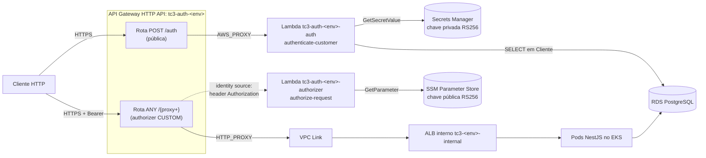

# API Gateway e Lambda

> **[ATUAL]** A borda serverless está implementada e provisionada. Este
> documento descreve os recursos reais, o contrato do token e como a aplicação
> no EKS consome esse contrato.
>
> Fontes: `repo-auth-serverless` na branch `main` (`infra/hml`, `infra/prod`,
> `src/`) e `src/auth/` deste repositório.
> Decisão em [ADR-0002](../adr/0002-autenticacao-centralizada-api-gateway-serverless.md);
> detalhes em [RFC-003](../rfcs/RFC-003-api-gateway-eks-integration.md) e
> [RFC-006](../rfcs/RFC-006-secrets-and-jwt.md).

## 1. Topologia

O API Gateway é o único ponto de entrada público do sistema. Nem o ALB, nem o
cluster, nem o banco são alcançáveis diretamente da internet.

## 2. Recursos provisionados

Um conjunto completo por ambiente, com `name_prefix` igual a `tc3-auth-hml` ou
`tc3-auth-prod`.

| Recurso Terraform | Nome | Papel |
|---|---|---|
| `aws_apigatewayv2_api.http` | `tc3-auth-<env>` | HTTP API v2 |
| `aws_apigatewayv2_stage.default` | `$default` | Stage com `auto_deploy = true` |
| `aws_lambda_function.auth` | `<prefix>-auth` | Emite o JWT a partir do CPF |
| `aws_lambda_function.authorizer` | `<prefix>-authorizer` | Lambda Authorizer das rotas protegidas |
| `aws_apigatewayv2_route.auth` | `POST /auth` | Rota pública, integração `AWS_PROXY` |
| `aws_apigatewayv2_route.protected` | `ANY /{proxy+}` | Rota protegida, integração `HTTP_PROXY` |
| `aws_apigatewayv2_authorizer.lambda` | `<prefix>-authorizer` | `REQUEST`, `enable_simple_responses = true`, identity source `$request.header.Authorization` |
| `aws_apigatewayv2_vpc_link.backend` | `<prefix>-backend` | Liga o API Gateway à VPC privada |
| `aws_cloudwatch_log_group` (x2) | `/aws/lambda/<prefix>-auth` e `-authorizer` | Logs, retenção de 30 dias |
| `aws_cloudwatch_metric_alarm` (x4) | erros das duas Lambdas, `5XXError` das duas rotas | Criados sem ação de notificação |

Ambas as funções rodam em `nodejs22.x` a partir do mesmo pacote `dist.zip`,
diferindo apenas no handler. A Lambda de autenticação tem `timeout = 10` e
entra na VPC (`vpc_config` com as subnets e o security group do banco) quando
`auth_lambda_vpc_enabled` está ligado, porque precisa consultar o RDS. O
authorizer não acessa banco e fica fora da VPC.

O `backend_integration_uri` é o ARN do **listener** do ALB interno, validado
por expressão regular no próprio Terraform. Quando `deploy_auth_only = true`,
a rota protegida, a integração e o VPC Link não são criados, o que permite
subir a autenticação antes de o cluster existir.

## 3. Contrato do token

O contrato é idêntico nos dois lados e travado por validação, não por
convenção.

| Campo | Valor | Onde é imposto |
|---|---|---|
| Algoritmo | `RS256` | `src/lib/jwt.ts` (constante) e `jwt.config.ts:38` no monólito |
| `iss` | `repo-auth-serverless` | `variable "jwt_issuer"` com `validation` que rejeita outro valor |
| `aud` | `async-furious-project` | `variable "jwt_audience"` com `validation` |
| `exp` | 1800 segundos (30 min) | `variable "jwt_expires_in"` com `validation`; o monólito exige o mesmo em produção |
| `sub` | `Cliente.id` | `signToken` rejeita `sub` vazio; o CPF nunca entra no token |

A chave privada RS256 fica no Secrets Manager e só a Lambda de autenticação a
lê. A chave pública fica no SSM Parameter Store e é lida por dois consumidores:
o authorizer, em tempo de execução, e o `deploy-eks.yml`, que a injeta no
Secret Kubernetes como `JWT_PUBLIC_KEY` e `JWT_CUSTOMER_PUBLIC_KEY`. Ambas as
chaves são cacheadas no contexto de execução da Lambda para evitar uma ida ao
Secrets Manager por invocação (`src/lib/keys.ts`).

## 4. Fluxo de autenticação

`POST /auth` com corpo `{ "cpf": "..." }`:

1. O handler normaliza o CPF, removendo pontuação, e valida os dois dígitos
   verificadores. Rejeita sequências de dígito único.
2. Consulta `SELECT "id", "ativo" FROM "Cliente" WHERE "documento" = $1 AND
   "tipo_documento" = 'CPF'`, com pool de no máximo 2 conexões, reaproveitado
   entre invocações.
3. Assina o JWT com `sub` igual ao `Cliente.id`.

| Situação | Resposta |
|---|---|
| Corpo não é JSON válido | `400 invalid_request` |
| `cpf` ausente ou não string | `400 invalid_request` |
| CPF com dígito verificador inválido | `401 unauthorized` |
| Cliente inexistente ou inativo | `401 unauthorized` |
| Sucesso | `200` com o token e o contrato explícito |

CPF malformado e cliente inexistente devolvem a mesma mensagem genérica, para
não permitir enumeração de clientes pela diferença de resposta.

## 5. Fluxo de autorização

O authorizer extrai o token do header `Authorization`, verifica assinatura,
`iss`, `aud` e `exp`, e responde no formato simples (`isAuthorized: true/false`).
Não há `403` distinto na borda: token ausente, malformado, expirado ou com
assinatura inválida produzem a mesma negativa.

Correlation ID atravessa toda a cadeia. O authorizer aceita um
`x-correlation-id` do cliente ou gera um a partir do `requestId`, devolve o
valor no contexto do authorizer, e a integração com o backend reescreve o
header com `"overwrite:header.x-correlation-id" = "$context.authorizer.correlation_id"`.
A aplicação no EKS recebe, portanto, um correlation ID já garantido.

Os logs das duas funções são JSON de uma linha com `level`, `event`,
`correlation_id` e `duration_ms`. Nenhum deles registra CPF ou token.

## 6. Como o monólito consome

A variável `AUTH_MODE` decide o comportamento. O `deploy-eks.yml` aplica
`AUTH_MODE=gateway` e `JWT_ALGORITHM=RS256` no ConfigMap em HML e PROD (passo
"Apply namespace and configuration") e injeta no Secret Kubernetes tanto a
chave pública (lida do SSM) quanto a **chave privada** RS256, buscada no
Secrets Manager pelo ARN do secret `JWT_PRIVATE_KEY_SECRET_ARN` (passo "Fetch
JWT private key from Secrets Manager").

Com `AUTH_MODE=gateway`, a aplicação aceita dois tipos de token, ambos RS256
com o mesmo emissor, audiência e expiração de 1800 segundos:

| Token | Quem emite | Claims | Como a aplicação resolve |
|---|---|---|---|
| Cliente | Lambda `authenticate-customer` (`POST /auth`) | só `sub` = `Cliente.id` | sem `role`: `JwtStrategy` chama `validateCustomer`, que exige `ativo = true` |
| Staff | a própria aplicação (`POST /api/v1/auth/login`), assinando com a mesma chave privada | `sub` = `User.id`, `email`, `role` | com `role`: `validateTokenSubject` busca o `User` e, se não achar, um `Cliente` ativo |

Como as duas origens usam o mesmo par de chaves, o authorizer da borda aceita
os dois tokens sem distinção. `resolveJwtContract` recusa HS256 quando
`NODE_ENV=production` e exige `JWT_PRIVATE_KEY` para assinar em produção
(`src/auth/jwt.config.ts`).

A validação acontece duas vezes por requisição protegida: na borda, pelo
authorizer, e na aplicação, que revalida a assinatura e reconsulta o banco. A
segunda camada existe porque o token carrega identidade, não estado: um
usuário desativado depois da emissão continuaria passando pelo authorizer.

### Login de staff atrás do gateway

`POST /api/v1/auth/login` não tem rota pública própria no API Gateway: ele cai
em `ANY /{proxy+}`, que exige authorizer. Na prática, o staff precisa primeiro
de um token válido para alcançar o login. O `full-acceptance.yml` faz
exatamente isso: obtém um token de cliente em `POST /auth` com o CPF semeado e
o usa como `Bearer` na chamada de login do administrador, do recepcionista e do
mecânico. Não encontrei documento que registre esse encadeamento como decisão.

O smoke test do deploy (`smoke-hml` e `smoke-prod`) chama
`/api/v1/health/live` pelo endpoint do gateway sem token e falha o pipeline se
a resposta não for `401` ou `403`, além de exigir alvo saudável no target
group.

## 7. Pendências

- O login de staff depende de um token prévio para atravessar o authorizer
  (seção 6). Funciona, mas não há rota pública de login de staff nem decisão
  registrada sobre esse desenho.
- A chave privada RS256 deixou de ficar restrita à Lambda: a aplicação também a
  recebe para assinar tokens de staff. Isso contradiz a premissa da RFC-006 de
  que a chave privada nunca sai de `repo-auth-serverless`.
- `validateCustomer` devolve `role: Role.RECEPCIONISTA` para um cliente
  autenticado por CPF, enquanto `validateTokenSubject` e `JwtCustomerStrategy`
  devolvem `Role.CLIENTE` para o mesmo sujeito
  (`src/auth/services/auth.service.ts`).
- Não há throttling nem WAF configurado no HTTP API. A rota `POST /auth` aceita
  tentativas sem limite de taxa.
- Os quatro alarmes CloudWatch desta borda são criados com
  `alarm_actions = []`. Os alertas com notificação do projeto estão na New
  Relic e consultam apenas `Transaction` da aplicação e `K8sContainerSample` do
  cluster, sem métricas das Lambdas. Ver
  [observability.md](./observability.md).
