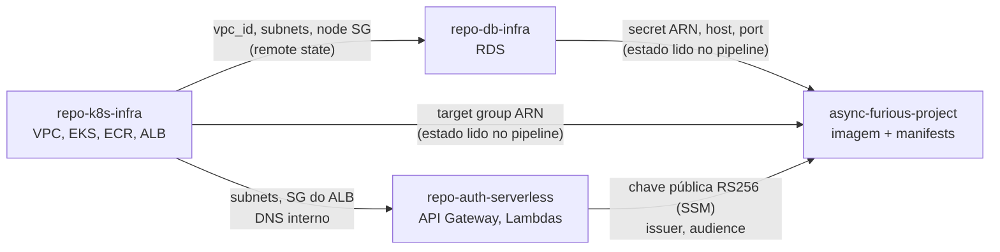

# Infraestrutura AWS

> **[ATUAL]** Este documento descreve a infraestrutura de nuvem efetivamente
> provisionada por Terraform, não uma proposta. As evidências citadas apontam
> para arquivos reais nos quatro repositórios do projeto.
>
> Fontes: branch `main` de `repo-k8s-infra`, `repo-db-infra` e
> `repo-auth-serverless`, e este repositório em `develop`.
> Decisões em [ADR-0001](../adr/0001-separacao-quatro-repositorios.md),
> [ADR-0003](../adr/0003-kubernetes-eks-orquestracao.md),
> [ADR-0004](../adr/0004-banco-dados-gerenciado.md),
> [RFC-003](../rfcs/RFC-003-api-gateway-eks-integration.md) e
> [RFC-004](../rfcs/RFC-004-vpc-ownership.md). A
> [RFC-007](../rfcs/RFC-007-rds-public-access.md), que propunha RDS público,
> está superada.

## 1. Divisão de responsabilidades

Cada recurso AWS tem exatamente um repositório dono. Nenhum repositório cria
recurso que pertence a outro.

| Repositório | Provisiona | Não provisiona |
|---|---|---|
| `repo-k8s-infra` | VPC, subnets, EKS, node group, ECR, ALB interno, target group, AWS Load Balancer Controller, Metrics Server, New Relic (bundle no cluster, dashboard, alertas) | Banco, Lambda, workloads da aplicação |
| `repo-db-infra` | RDS PostgreSQL, subnet group, parameter group, security group do banco, alarmes | VPC (consome de `repo-k8s-infra`) |
| `repo-auth-serverless` | Lambdas de autenticação, API Gateway HTTP, authorizer, VPC Link, alarmes | Cluster, banco, rede |
| `async-furious-project` (este) | Nenhum recurso AWS via Terraform. Publica imagem no ECR e aplica manifests Kubernetes no cluster alheio | Toda a infraestrutura acima |

Este repositório não possui estado Terraform na AWS. Seu
`.github/workflows/terraform.yml` valida apenas o ambiente local `kind` em
`infra/environments/local`.

## 2. Ambientes e convenção de nomes

Dois ambientes lógicos, `hml` e `prod`, na mesma conta AWS, separados por
chave de estado Terraform e por nome de recurso.

| Recurso | Nome | Evidência |
|---|---|---|
| VPC | `tc3-vpc-<env>` | `repo-k8s-infra/modules/vpc/main.tf:6` |
| Cluster EKS | `tc3-eks-<env>` | `repo-k8s-infra/modules/eks/main.tf:39` |
| Repositório ECR | `tc3-app-<env>` | `repo-k8s-infra/modules/ecr/main.tf:2` |
| ALB interno | `tc3-<env>-internal` | `repo-k8s-infra/modules/alb/main.tf:28` |
| Target group | `tc3-<env>-app` | `repo-k8s-infra/modules/alb/main.tf:37` |
| Instância RDS | `tc3-db-<env>` | `repo-db-infra/modules/rds/main.tf:65` |
| HTTP API | `tc3-auth-<env>` | `.github/workflows/deploy-eks.yml`, jobs `smoke-hml` e `smoke-prod` (localizam a API por esse nome) |

Região padrão `us-east-1`, sobrescrevível pela variável de repositório
`AWS_REGION`. Todos os recursos de `repo-k8s-infra` recebem as tags padrão
`Project=tc3`, `Environment=<env>`, `ManagedBy=terraform`.

## 3. Estado Terraform e integração entre repositórios

O estado fica em um bucket S3 nomeado pela conta: `tc3-tfstate-<account_id>`.
Cada repositório grava sob sua própria chave.

```
s3://tc3-tfstate-<account_id>/repo-k8s-infra/<env>/terraform.tfstate
s3://tc3-tfstate-<account_id>/repo-db-infra/<env>/terraform.tfstate
```

Esse bucket é o mecanismo de integração entre os repositórios, resolvendo o
problema levantado pela [RFC-004](../rfcs/RFC-004-vpc-ownership.md). Há duas
formas de consumo em uso:

**Remote state nativo.** `repo-db-infra` lê os outputs de `repo-k8s-infra`
via `data "terraform_remote_state"`, sem cópia manual de IDs para `tfvars`
(`repo-db-infra/main.tf`). É assim que ele descobre `vpc_id`,
`private_subnet_ids` e `node_security_group_id`. `repo-auth-serverless` faz o
mesmo com os estados de `repo-k8s-infra` (subnets privadas, security group e
listener do ALB) e de `repo-db-infra` (security group do banco e ARN do
segredo de conexão).

**Leitura do arquivo de estado no pipeline.** Este repositório não roda
Terraform contra a AWS, então o `deploy-eks.yml` baixa o `terraform.tfstate`
dos outros dois com `aws s3 cp` e extrai os outputs com `jq`
(passos "Resolve target group ARN from repo-k8s-infra state" e "Resolve database outputs from repo-db-infra state" do `.github/workflows/deploy-eks.yml`). Os valores lidos são:

| Origem | Output | Uso |
|---|---|---|
| `repo-k8s-infra` | `application_target_group_arn` (fallback `internal_alb_target_group_arn`) | Preenche o `TargetGroupBinding` que registra os pods no ALB |
| `repo-db-infra` | `db_connection_secret_arn` (fallback `db_secret_arn`) | Busca usuário e senha no Secrets Manager |
| `repo-db-infra` | `db_host`, `db_port`, `db_name`, `db_ssl_mode` | Monta a `DATABASE_URL` do Secret Kubernetes |

O ARN do target group é validado por expressão regular antes do uso, e host e
ARN do segredo são mascarados no log do runner.

Consequência operacional: a ordem de provisionamento é obrigatória. Rede e
cluster primeiro, banco depois, borda serverless por último, aplicação ao
final.

## 4. Rede

`repo-k8s-infra/modules/vpc` usa o módulo oficial `terraform-aws-modules/vpc`
(`~> 5.13`) com CIDR `10.0.0.0/16` em duas AZs (`us-east-1a`, `us-east-1b`).
As subnets são derivadas por `cidrsubnet`: as públicas ocupam os índices 0 e 1,
as privadas os índices 10 e 11.

O cluster EKS fica nas subnets privadas. O ALB é interno
(`internal = true`), também em subnets privadas, e nunca é exposto à internet.
Seu security group aceita tráfego apenas do CIDR da própria VPC
(`repo-k8s-infra/modules/alb/main.tf:15,23`). A única porta de entrada pública
do sistema é o API Gateway.

## 5. Computação: EKS

| Item | Valor | Evidência |
|---|---|---|
| Versão do Kubernetes | `1.30` no módulo; o root usa `cluster_version = null` e preserva a versão de um cluster existente | `modules/eks/variables.tf`, `variables.tf` |
| Tipo de instância dos nós | `t3.small` | `main.tf` (`coalesce(var.node_instance_types, ["t3.small"])`) |
| Capacidade | SPOT em HML, ON_DEMAND em PROD | `modules/eks/main.tf` (`capacity_type`) |
| Node group | desired 3, min 2, max 3 | `variables.tf` |
| Endpoint da API | privado por padrão (`cluster_endpoint_public_access = false`) | `modules/eks/variables.tf` |

Três add-ons são instalados por Helm, direto do Terraform
(`repo-k8s-infra/main.tf`):

- **AWS Load Balancer Controller** `1.8.2`, que traz o CRD
  `TargetGroupBinding` usado pela aplicação para se registrar no ALB.
- **Metrics Server** `3.12.2`, pré-requisito do HPA.
- **New Relic bundle**, agente de infraestrutura e coleta do cluster. O mesmo
  root cria dashboard, política de alertas e notificação por e-mail na New
  Relic. Ver [observability.md](./observability.md).

O endpoint privado tem uma consequência direta no pipeline: o runner do GitHub
Actions não alcança a API do cluster. O `deploy-eks.yml` resolve isso abrindo o
endpoint temporariamente apenas para o IP do runner, com `/32`, e restaurando a
configuração original em um passo `if: always()`
(passos "Allow HML runner to reach Academy EKS" e "Restore original HML EKS endpoint access" do `.github/workflows/deploy-eks.yml`). O mesmo padrão existe no
`cleanup-eks.yml`.

## 6. Registry: ECR

Repositório `tc3-app-<env>` com `image_tag_mutability = IMMUTABLE` e
`scan_on_push = true`. Política de ciclo de vida expira imagens sem tag após 7
dias (`repo-k8s-infra/modules/ecr/main.tf`).

A imutabilidade da tag é intencional e o pipeline foi escrito em torno dela: a
tag é o SHA do commit, e o job de build primeiro verifica se a imagem já existe
(`aws ecr describe-images`). Se existir, reusa; se o push falhar por tag
imutável já publicada, trata como corrida vencida por outro job e segue com o
digest existente. O que é passado adiante para o deploy não é a tag, é o
digest (`registry/repo@sha256:...`), o que garante que HML e PROD rodam
exatamente o mesmo binário (passo "Build and push commit-SHA image" do `.github/workflows/deploy-eks.yml`).

## 7. Banco de dados gerenciado: RDS

| Item | Valor |
|---|---|
| Engine | PostgreSQL `16.4` |
| Classe | `db.t4g.micro` (padrão) |
| Armazenamento | 20 GB, criptografado (`storage_encrypted = true`) |
| Database | `workshop`, usuário `postgres` |
| Senha | gerenciada pelo RDS via Secrets Manager (`manage_master_user_password = true`), nunca no estado Terraform |
| Backup | 1 dia nos dois ambientes |
| Multi-AZ | somente PROD |
| Proteção de deleção e snapshot final | somente PROD (a proteção é desligada em `destroy_mode`) |
| SSL | obrigatório, `rds.force_ssl = 1` no parameter group |

O RDS é privado nos dois ambientes. `publicly_accessible = false` é fixo no
root e reforçado por `precondition` e `postcondition` no módulo. As subnets do
banco são as subnets privadas publicadas por `repo-k8s-infra`, e um
`precondition` falha o plano se qualquer uma delas tiver rota para Internet
Gateway (`repo-db-infra/main.tf`).

O ingresso difere por ambiente: HML aceita apenas os CIDRs explícitos de
`hml_allowed_cidr_blocks` (obrigatórios, nunca `0.0.0.0/0`), PROD aceita apenas
security groups, incluindo o dos nós do EKS lido do estado de `repo-k8s-infra`.
A Lambda de autenticação roda dentro da VPC e alcança o banco por security
group. A [RFC-007](../rfcs/RFC-007-rds-public-access.md), que chegou a
propor RDS público em HML, está superada.

Três alarmes CloudWatch acompanham a instância: CPU acima de 80%, armazenamento
livre abaixo de 2 GiB e conexões acima de 80. Os destinos vêm das variáveis
`alarm_actions` e `alarm_ok_actions`, alimentadas pelos secrets
`HML_ALARM_ACTIONS`/`PROD_ALARM_ACTIONS` do pipeline; se estão preenchidos em
cada Environment não é visível pelo repositório.

Ver [database.md](./database.md) para o modelo de dados e o histórico da
decisão de versão.

## 8. Borda: API Gateway e Lambda

Documentado em detalhe em
[api-gateway-lambda.md](./api-gateway-lambda.md). Em resumo: um HTTP API v2
por ambiente, uma Lambda que emite JWT RS256 a partir do CPF, um Lambda
Authorizer que valida o token, e uma integração `HTTP_PROXY` via VPC Link que
encaminha as rotas protegidas para o ALB interno.

## 9. Segredos e parâmetros

| Onde | O que | Quem escreve | Quem lê |
|---|---|---|---|
| Secrets Manager | Credenciais master do RDS (JSON com `username`/`password`) | RDS | `deploy-eks.yml`, Lambda de autenticação |
| Secrets Manager | Chave privada RS256 | Operador | Lambda `authenticate-customer` e `deploy-eks.yml`, que a entrega à aplicação para assinar tokens de staff |
| SSM Parameter Store | Chave pública RS256 | Operador | Lambda `authorize-request` e `deploy-eks.yml` |
| Secret Kubernetes `async-furious-secret` | `DATABASE_URL`, credenciais, `JWT_PUBLIC_KEY`, `JWT_PRIVATE_KEY`, `WEBHOOK_SECRET`, `NEW_RELIC_LICENSE_KEY`, seeds | `deploy-eks.yml`, em tempo de deploy | Pods da aplicação |

Nenhuma credencial de banco é output Terraform nem variável do GitHub. O
pipeline resolve o ARN do segredo pelo estado remoto, busca o JSON no Secrets
Manager, faz percent-encoding de usuário e senha em Python antes de montar a
`DATABASE_URL`, e aplica o Secret por `kubectl create ... --dry-run=client -o
yaml | kubectl apply -f -` (passo "Apply namespace and configuration" do `.github/workflows/deploy-eks.yml`). Os
valores são mascarados com `::add-mask::`.

Ver [ADR-0015](../adr/0015-segredos-kubernetes-templatefile.md) para o
tratamento equivalente no ambiente local e
[RFC-006](../rfcs/RFC-006-secrets-and-jwt.md) para a estratégia de chaves.

## 10. Modo AWS Academy

O projeto roda em conta AWS Academy, que não permite criar roles IAM
arbitrárias. Os três repositórios de infraestrutura têm uma variável
`aws_academy` (e `manage_iam`, `lab_role_arn`) que, quando ativada, faz os
módulos reusarem a `LabRole` existente em vez de criar IRSA ou roles próprias
(`repo-k8s-infra/variables.tf`, `repo-auth-serverless/infra/hml/variables.tf`).

A autenticação dos workflows acompanha essa restrição: em vez de OIDC, os
pipelines usam `AWS_ACCESS_KEY_ID`, `AWS_SECRET_ACCESS_KEY` e
`AWS_SESSION_TOKEN` da sessão Academy, que expiram e precisam ser renovados a
cada sessão. Ver [aws-setup.md](../runbooks/aws-setup.md).

Em HML, o ECR é criado com `force_delete = true` para permitir destruir o
ambiente sem esvaziar o registry manualmente.

## 11. Ordem de provisionamento



## 12. Pendências

- Não há Terraform de bootstrap para o bucket `tc3-tfstate-<account_id>`. Ele é
  criado por scripts nos próprios repositórios
  (`.github/scripts/bootstrap-backend.sh` em `repo-k8s-infra`, `repo-db-infra`
  e `repo-auth-serverless`), fora do ciclo de vida do Terraform. O mesmo script
  gera o `backend.hcl` por ambiente a partir do ID da conta viva, o que explica
  por que os arquivos `backend.tf` versionados são configurações parciais
  (`backend "s3" {}`) sem bucket nem chave.
- O travamento de estado usa o lock nativo do S3 (`use_lockfile = true`,
  Terraform 1.11+), escrito no `backend.hcl` gerado. Não há tabela DynamoDB
  para provisionar.
- O ALB interno serve HTTP na porta 80, sem TLS. É uma exceção documentada com
  `#trivy:ignore:AWS-0054` no código, justificada por não haver certificado ACM
  nem domínio contratado. O TLS termina no API Gateway.
- `k8s/overlays/aws/` (kustomization, ingress, patches) existe no repositório
  mas não é referenciado por nenhum workflow ou script. O deploy real aplica os
  manifests base com substituição via `sed`. Ver
  [kubernetes.md](./kubernetes.md).
