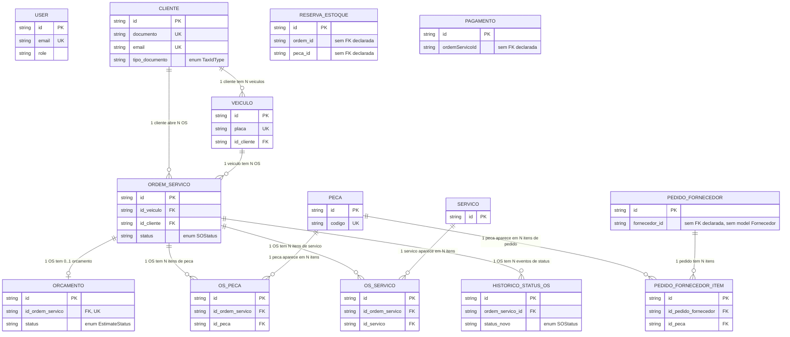

# Banco de Dados

> Documenta a camada de persistência e o modelo de dados da aplicação, para
> a demanda "Elaborar Documentação da Persistência e Modelo de Dados" da
> Fase 3. Este arquivo está sendo escrito em paralelo à
> [PR #175](https://github.com/Async-And-Furious/async-furious-project/pull/175)
> (`doc/ArchDocs_diagrams`), que já criou um `docs/infrastructure/database.md`
> próprio com o estado por ambiente. As duas versões vão precisar de
> reconciliação manual quando uma das branches for mesclada primeiro.

## Estado por ambiente

| Ambiente | Onde roda | Versão | Evidência |
| --- | --- | --- | --- |
| Dev local (`docker compose`) | `docker-compose.dependencies.yml` | `postgres:15-alpine` | `docker-compose.dependencies.yml:3` |
| CI (`tests.yml`) | Serviço containerizado no runner | `postgres:16` | `.github/workflows/tests.yml:18` |
| Kubernetes local (`kind`) | `StatefulSet` | `postgres:15-alpine` | `k8s/database/statefulset.yaml:20` |
| Nuvem (proposto Fase 3) | RDS, provisionado por `repo-db-infra` (`modules/rds`) | PostgreSQL 16 (decidido, não aplicado) | ADR-0004 e RFC de banco (PR #172, branch `docs/database-justification-pg16`); nenhum `terraform apply` executado até o momento |

Existe uma divergência ativa: dev local e o `StatefulSet` do Kubernetes local
ainda estão em Postgres 15, enquanto o CI já roda 16 e a decisão definitiva
para produção (RDS) também é 16. A correção já foi feita na branch não
mesclada `docs/database-justification-pg16` (PR #172), mas não está
aplicada nesta branch.

## Diagrama ER

Gerado a partir do `prisma/schema.prisma` real (17 models, 3 enums), não de
um rascunho manual. Mostra apenas colunas de identidade (PK/FK/UK); o
detalhamento completo de colunas está na seção
[Modelo relacional](#modelo-relacional).

Três entidades ficam fora das linhas de relacionamento do diagrama porque o
schema não declara `@relation` nelas, mesmo guardando um ID de outra
entidade:

- `PedidoFornecedor.fornecedor_id`: não existe model `Fornecedor` no schema.
  O fornecedor é só uma string solta, sem integridade referencial no banco.
- `ReservaEstoque.ordem_id` e `ReservaEstoque.peca_id`: apontam
  conceitualmente para `OrdemServico` e `Peca`, mas sem `@relation` nem FK
  real no Postgres.
- `Pagamento.ordemServicoId`: mesma situação, aponta para `OrdemServico`
  sem FK declarada.

`User` também fica isolado no diagrama: é a entidade de autenticação, sem
nenhum relacionamento com o domínio de negócio.

### Enums

- `TaxIdType`: `CPF`, `CNPJ`.
- `SOStatus`: `RECEIVED`, `UNDER_DIAGNOSIS`, `AWAITING_APPROVAL`,
  `IN_PROGRESS`, `AWAITING_PARTS`, `FINISHED`, `DELIVERED`,
  `CLOSED_WITHOUT_EXECUTION`.
- `EstimateStatus`: `PENDING`, `APPROVED`, `REJECTED`.

## Modelo relacional

Todas as PKs seguem o mesmo padrão: coluna `id`, tipo `text` (não é o tipo
nativo `uuid` do Postgres), valor gerado pelo Prisma Client via
`@default(uuid())`, não por um `DEFAULT` do próprio banco. Isso não é
repetido tabela por tabela abaixo.

### `User`

| Coluna | Tipo | Constraints |
| --- | --- | --- |
| id | text | PK |
| email | text | UNIQUE, not null |
| password | text | not null |
| name | text | not null |
| role | text | not null, default `"admin"` |
| created_at | timestamp | default now() |
| updated_at | timestamp | auto-update |

Sem relacionamento com nenhuma outra tabela. É a entidade de autenticação
local (papéis `ADMIN`, `RECEPCIONISTA`, `MECANICO` aplicados via `role`).

### `Cliente`

| Coluna | Tipo | Constraints |
| --- | --- | --- |
| id | text | PK |
| nome | text | not null |
| email | text | UNIQUE, not null |
| telefone | text | nullable |
| documento | text | UNIQUE, not null |
| tipo_documento | `TaxIdType` (enum) | not null |
| created_at | timestamp | default now() |
| updated_at | timestamp | auto-update |

### `Veiculo`

| Coluna | Tipo | Constraints |
| --- | --- | --- |
| id | text | PK |
| placa | text | UNIQUE, not null |
| marca | text | not null |
| modelo | text | not null |
| ano | integer | not null |
| cor | text | nullable |
| id_cliente | text | FK -> `Cliente.id`, `ON DELETE CASCADE`, not null |
| created_at | timestamp | default now() |
| updated_at | timestamp | auto-update |

### `OrdemServico`

| Coluna | Tipo | Constraints |
| --- | --- | --- |
| id | text | PK |
| id_veiculo | text | FK -> `Veiculo.id`, `ON DELETE CASCADE`, not null |
| id_cliente | text | FK -> `Cliente.id`, `ON DELETE CASCADE`, not null |
| status | `SOStatus` (enum) | not null, default `RECEIVED` |
| descricao | text | nullable |
| iniciada_em | timestamp | nullable |
| finalizada_em | timestamp | nullable |
| entregue_em | timestamp | nullable |
| created_at | timestamp | default now() |
| updated_at | timestamp | auto-update |

`id_veiculo` e `id_cliente` são redundantes entre si (todo veículo já
aponta pra um cliente único via `Veiculo.id_cliente`), mas ambos ficam
gravados direto na OS. Isso evita um join extra pra achar o dono da OS e
permite, em tese, uma OS registrar um cliente diferente do dono atual do
veículo (não validado em nenhum lugar do código auditado aqui).

### `Orcamento`

| Coluna | Tipo | Constraints |
| --- | --- | --- |
| id | text | PK |
| id_ordem_servico | text | FK -> `OrdemServico.id`, `ON DELETE CASCADE`, UNIQUE, not null |
| valor_total_servicos | numeric(10,2) | not null, default 0 |
| valor_total_pecas | numeric(10,2) | not null, default 0 |
| valor_total_geral | numeric(10,2) | not null, default 0 |
| status | `EstimateStatus` (enum) | not null, default `PENDING` |
| created_at | timestamp | default now() |
| updated_at | timestamp | auto-update |

O `UNIQUE` em `id_ordem_servico` é o que torna a relação 1:0..1 com
`OrdemServico` (uma OS tem no máximo um orçamento).

### `Peca`

| Coluna | Tipo | Constraints |
| --- | --- | --- |
| id | text | PK |
| nome | text | not null |
| codigo | text | UNIQUE, not null |
| descricao | text | nullable |
| preco | numeric(10,2) | not null |
| quantidade_estoque | integer | not null, default 0 |
| quantidade_minima | integer | not null, default 1 |
| created_at | timestamp | default now() |
| updated_at | timestamp | auto-update |

### `Servico`

| Coluna | Tipo | Constraints |
| --- | --- | --- |
| id | text | PK |
| nome | text | not null |
| descricao | text | nullable |
| preco | numeric(10,2) | not null |
| created_at | timestamp | default now() |
| updated_at | timestamp | auto-update |

### `OsPeca`

| Coluna | Tipo | Constraints |
| --- | --- | --- |
| id | text | PK |
| id_ordem_servico | text | FK -> `OrdemServico.id`, `ON DELETE CASCADE`, not null |
| id_peca | text | FK -> `Peca.id`, `ON DELETE RESTRICT`, not null |
| quantidade | integer | not null |
| preco_unitario | numeric(10,2) | not null |
| valor_total | numeric(10,2) | not null |
| created_at | timestamp | default now() |
| updated_at | timestamp | auto-update |

`UNIQUE(id_ordem_servico, id_peca)`: uma peça aparece no máximo uma vez por
OS (quantidade é ajustada na mesma linha, não duplicada).
`ON DELETE RESTRICT` em `id_peca` impede apagar uma peça que já foi usada
em alguma OS.

### `OsServico`

| Coluna | Tipo | Constraints |
| --- | --- | --- |
| id | text | PK |
| id_ordem_servico | text | FK -> `OrdemServico.id`, `ON DELETE CASCADE`, not null |
| id_servico | text | FK -> `Servico.id`, `ON DELETE RESTRICT`, not null |
| quantidade | integer | not null, default 1 |
| preco_unitario | numeric(10,2) | not null |
| valor_total | numeric(10,2) | not null |
| created_at | timestamp | default now() |
| updated_at | timestamp | auto-update |

Mesmo padrão de `OsPeca`: `UNIQUE(id_ordem_servico, id_servico)` e
`ON DELETE RESTRICT` em `id_servico`.

### `PedidoFornecedor`

| Coluna | Tipo | Constraints |
| --- | --- | --- |
| id | text | PK |
| fornecedor_id | text | not null, **sem FK** |
| status | text | not null, default `"PENDENTE"` (valores usados no código: `PENDENTE`, `RECEBIDO`; não é enum do Prisma) |
| criado_em | timestamp | default now() |
| atualizado_em | timestamp | auto-update |

`fornecedor_id` não referencia nenhuma tabela porque não existe model
`Fornecedor` no schema. É um identificador externo solto, sem integridade
referencial garantida pelo banco.

### `PedidoFornecedorItem`

| Coluna | Tipo | Constraints |
| --- | --- | --- |
| id | text | PK |
| id_pedido_fornecedor | text | FK -> `PedidoFornecedor.id`, `ON DELETE CASCADE`, not null |
| id_peca | text | FK -> `Peca.id`, `ON DELETE RESTRICT`, not null |
| quantidade_solicitada | integer | not null |
| quantidade_recebida | integer | not null, default 0 |

Única tabela do schema sem `created_at`/`updated_at`.

### `ReservaEstoque`

| Coluna | Tipo | Constraints |
| --- | --- | --- |
| id | text | PK |
| ordem_id | text | not null, **sem FK** (aponta conceitualmente pra `OrdemServico.id`) |
| peca_id | text | not null, **sem FK** (aponta conceitualmente pra `Peca.id`) |
| quantidade | integer | not null |
| reservado_em | timestamp | default now() |

`UNIQUE(ordem_id, peca_id)`, mas sem `@relation` em nenhum dos dois campos.
Postgres não impede inserir uma reserva com `ordem_id`/`peca_id` que não
existem em `OrdemServico`/`Peca`.

### `Pagamento` (tabela física: `pagamentos`, via `@@map`)

| Coluna | Tipo | Constraints |
| --- | --- | --- |
| id | text | PK |
| ordemServicoId | text | not null, **sem FK** (aponta conceitualmente pra `OrdemServico.id`) |
| valor | numeric(10,2) | not null |
| status | text | not null (sem enum do Prisma) |
| createdAt | timestamp | default now() |

Única tabela sem `updated_at`, e a única com colunas em camelCase
(`ordemServicoId`, `createdAt`) em vez do `snake_case` usado no resto do
schema.

### `HistoricoStatusOS` (tabela física: `historico_status_os`, via `@@map`)

| Coluna | Tipo | Constraints |
| --- | --- | --- |
| id | text | PK |
| ordem_servico_id | text | FK -> `OrdemServico.id`, `ON DELETE CASCADE`, not null |
| status_anterior | `SOStatus` (enum) | nullable |
| status_novo | `SOStatus` (enum) | not null |
| motivo | text | nullable |
| data_hora | timestamp | default now() |

Log de eventos, imutável por natureza: só tem `data_hora`, sem
`created_at`/`updated_at`.

## Relacionamentos entre tabelas

| Origem (FK) | Coluna | Destino | `ON DELETE` | Cardinalidade |
| --- | --- | --- | --- | --- |
| `Veiculo` | `id_cliente` | `Cliente` | CASCADE | N:1 |
| `OrdemServico` | `id_veiculo` | `Veiculo` | CASCADE | N:1 |
| `OrdemServico` | `id_cliente` | `Cliente` | CASCADE | N:1 |
| `Orcamento` | `id_ordem_servico` | `OrdemServico` | CASCADE | 1:1 (UNIQUE) |
| `OsPeca` | `id_ordem_servico` | `OrdemServico` | CASCADE | N:1 |
| `OsPeca` | `id_peca` | `Peca` | RESTRICT | N:1 |
| `OsServico` | `id_ordem_servico` | `OrdemServico` | CASCADE | N:1 |
| `OsServico` | `id_servico` | `Servico` | RESTRICT | N:1 |
| `PedidoFornecedorItem` | `id_pedido_fornecedor` | `PedidoFornecedor` | CASCADE | N:1 |
| `PedidoFornecedorItem` | `id_peca` | `Peca` | RESTRICT | N:1 |
| `HistoricoStatusOS` | `ordem_servico_id` | `OrdemServico` | CASCADE | N:1 |
| *(sem FK)* `ReservaEstoque` | `ordem_id`, `peca_id` | `OrdemServico`, `Peca` | n/a | N:1, N:1 (não garantido pelo banco) |
| *(sem FK)* `Pagamento` | `ordemServicoId` | `OrdemServico` | n/a | N:1 (não garantido pelo banco) |
| *(sem FK)* `PedidoFornecedor` | `fornecedor_id` | nenhuma tabela (sem model `Fornecedor`) | n/a | n/a |

`ON DELETE CASCADE` domina o schema: apagar um `Cliente` apaga em cascata
seus veículos, OSs, orçamentos, itens de OS e histórico de status.
`ON DELETE RESTRICT` só aparece nas duas tabelas de junção que referenciam
`Peca`/`Servico` (`OsPeca`, `OsServico`, `PedidoFornecedorItem`), impedindo
apagar uma peça ou serviço já usado.

## Mapeamento entre entidades de domínio e tabelas

Comparado com a linguagem ubíqua descrita em [`ddd.md`](../ddd.md) §2-4:

| Termo de domínio (`ddd.md`) | Nome citado no `ddd.md` | Model/tabela real no Prisma | Observação |
| --- | --- | --- | --- |
| Ordem de Serviço | `OrdemDeServico` | `OrdemServico` | Nome diverge: `ddd.md` usa "OrdemDeServico", o schema usa "OrdemServico" |
| Cliente | `Cliente` | `Cliente` | Igual |
| Veículo | `Veiculo` | `Veiculo` | Igual |
| Serviço | `Servico` | `Servico` | Igual |
| Peça/Insumo | `PecaInsumo` | `Peca` | Nome diverge: `ddd.md` usa "PecaInsumo", o schema usa "Peca" |
| Orçamento | `Orcamento` (Value Object da OS, em `ddd.md` §4.1) | `Orcamento` (entidade própria, tabela e FK dedicadas) | `ddd.md` modela como Value Object; a persistência real é uma entidade com identidade própria (`id`, tabela, relação 1:1 com `OrdemServico`) |
| Status da OS | `status` (campo simples) | `OrdemServico.status` (enum) + tabela `historico_status_os` | `ddd.md` não menciona o histórico de status como algo persistido à parte |
| Estoque | `quantidade_estoque` | `Peca.quantidade_estoque` | Igual |

Tabelas sem entrada correspondente na linguagem ubíqua de `ddd.md` (são
tabelas de suporte/junção, não conceitos de negócio nomeados no documento):
`User`, `OsPeca`, `OsServico`, `PedidoFornecedor`, `PedidoFornecedorItem`,
`ReservaEstoque`, `Pagamento`, `HistoricoStatusOS`.

## Convenções observadas (e onde elas quebram)

- **Nomenclatura de tabela**: 15 dos 17 models não usam `@@map`, então a
  tabela física tem o mesmo nome do model, em PascalCase (`Cliente`,
  `OrdemServico`, `OsPeca` etc.) e precisa de aspas duplas no Postgres.
  Só `Pagamento` (-> `pagamentos`) e `HistoricoStatusOS` (->
  `historico_status_os`) usam `@@map` para `snake_case`. Não há
  justificativa registrada em nenhum commit para essa divergência.
- **Nomenclatura de coluna de timestamp**: a maioria usa
  `created_at`/`updated_at` em `snake_case`. Exceções: `PedidoFornecedor`
  usa `criado_em`/`atualizado_em` (português), `Pagamento` usa
  `createdAt` (camelCase) e não tem `updated_at`, e
  `PedidoFornecedorItem`/`ReservaEstoque`/`HistoricoStatusOS` não têm
  `updated_at` nenhum.
- **Enums do Prisma vs. `status` como texto livre**: `SOStatus` e
  `EstimateStatus` são enums reais do Prisma (com constraint no banco). Já
  `PedidoFornecedor.status` e `Pagamento.status` são `text` livre, com os
  valores válidos garantidos só por convenção no código da aplicação, não
  pelo banco.

## Justificativa do PostgreSQL

A engine nunca esteve realmente em aberto: a aplicação usa PostgreSQL
exclusivamente via Prisma desde o primeiro commit que criou o schema
(`c8f7167`, 25/03), com `datasource db { provider = "postgresql" }`. Trocar
de engine (por exemplo para MySQL) significaria reescrever schema,
migrations e revalidar toda a lógica de negócio contra outro dialeto SQL,
sem nenhuma justificativa registrada para esse custo.

O ponto que ficou de fato em aberto foi a **versão**, que divergia entre
ambientes (ver [Estado por ambiente](#estado-por-ambiente)): CI já usava
`postgres:16`, dev local e o `StatefulSet` do Kubernetes local usavam
`postgres:15-alpine`, e a versão do RDS estava indefinida. Esse
raciocínio, e a decisão de fixar **PostgreSQL 16** em todos os ambientes,
foi formalizado pelo trigo na RFC de banco (PR #172, branch
`docs/database-justification-pg16`, status "Accepted" no próprio arquivo) e
na [ADR-0004](https://github.com/Async-And-Furious/async-furious-project/blob/doc/ArchDocs_diagrams/docs/adr/0004-banco-dados-gerenciado.md)
da PR #175. Não duplicado aqui: a RFC já resolve a questão, este documento
só referencia a conclusão porque ela é pré-requisito pro resto do modelo de
dados.

PostgreSQL gerenciado (RDS) também satisfaz diretamente o requisito de
"banco de dados gerenciado" da Fase 3: backups automáticos, criptografia em
repouso e failover Multi-AZ em produção, sem operação manual de banco.

## Justificativa do Prisma

Não existe ADR, RFC nem discussão registrada escolhendo Prisma sobre outro
ORM (TypeORM, Sequelize etc.) — foi a escolha de scaffold desde o commit
inicial (`ed2258d`, "Scaffold NestJS API, Prisma, Docker, Auth") e nunca foi
revisitada. A justificativa abaixo é técnica, baseada no uso real observado
no repositório, não em uma decisão formal documentada:

- **Tipagem forte ponta a ponta**: o Prisma Client é gerado a partir do
  `schema.prisma` (`generator client { provider = "prisma-client-js" }`) e
  os repositórios em `src/modules/*/infrastructure/repositories/*.ts`
  consomem esse client tipado, eliminando a categoria de erro "coluna não
  existe"/"tipo errado" em tempo de compilação, coerente com o resto do
  projeto ser 100% TypeScript.
- **Migrations como parte do fluxo de deploy**: `prisma migrate dev` no
  desenvolvimento local (`AGENTS.md`, `pnpm run dev`) e `prisma migrate
  deploy` rodando no init container `migrate` antes de cada pod da API
  subir no Kubernetes (README, seção de Infraestrutura). O modelo de
  migrations do Prisma já está integrado ao pipeline de deploy real do
  projeto, trocar de ORM agora re-abriria essa integração também.
- **Alinhamento com Clean Architecture**: o `PrismaService` fica isolado na
  camada `infrastructure` de cada módulo (regra de dependência
  `presentation -> application -> domain <- infrastructure` descrita no
  README), então o Prisma Client nunca vaza pra `domain`/`application` —
  detalhe de implementação que o próprio ORM não impõe, mas que o projeto
  segue de forma consistente nos módulos auditados aqui.

## Decisões de evolução do modelo

Reconstruído a partir do `git log` de `prisma/schema.prisma` (não é uma
transcrição de nenhuma ADR/RFC existente, porque nenhuma cobre a evolução
do schema até o momento desta tarefa):

| Data | Commit | O que mudou | Por quê (quando registrado na mensagem do commit) |
| --- | --- | --- | --- |
| 2026-03-25 | `c8f7167` | Schema inicial: `User`, engine PostgreSQL via Prisma. | Scaffold do projeto. |
| 2026-04-22 | `47544a0` | Campos de `Customer`/`Vehicle`/`ServiceOrder` renomeados pra português no schema (`nome`, `telefone`, `placa`, `id_veiculo` etc.), mas as colunas físicas mantidas em inglês via `@map()`. | "Alinhar o código à linguagem ubíqua definida no `ddd.md`", sem exigir migration (só troca de nome no lado do Prisma). |
| 2026-04-25 | `8f8a662` | `Orcamento` extraído de `ServiceOrder` para tabela própria com relação 1:1. Os campos `valor_total_*`, `estimate_status` saem da OS; o campo booleano `orcamento_aprovado` é removido e substituído pelo enum `EstimateStatus` (que já existia) como único indicador de status do orçamento. | Mensagem do commit: "extract Orcamento as standalone DDD entity with own table and repository". |
| 2026-04-28 | `7ff1656` | `@map()`/`@@map()` removidos de `Cliente`, `Veiculo`, `OrdemServico`, `Orcamento`: as tabelas e colunas físicas passam a ser literalmente os nomes em português (antes só o Prisma Client via, o banco continuava em inglês). | "Renomeando as tabelas pra português" — sem justificativa adicional na mensagem do commit. É esta decisão que fixou a convenção "nome do model = nome físico da tabela, PascalCase, sem `@@map`" que a maioria do schema segue hoje. |
| 2026-04-28 | `ec0fa66` | Tabela de junção `OsPeca` adicionada, relacionando `OrdemServico` e `Peca`. | "add OsPeca model and establish relationships in OrdemServico and Peca". |
| 2026-05-01 | `41179b6` | Módulo Financeiro: tabela `Pagamento` adicionada, já com `@@map("pagamentos")` (snake_case) — quebrando a convenção fixada três dias antes em `7ff1656`. | "Criação de módulo Financeiro", sem justificativa da escolha de nomenclatura na mensagem do commit. |
| 2026-06-02 | `f85cdc4` | Tabela de junção `OsServico` adicionada, espelhando o padrão de `OsPeca` para o par `OrdemServico`/`Servico`. | "Criação de fluxo de os-servico". |
| 2026-07-07 | `03693e9` | Tabela `HistoricoStatusOS` adicionada, também com `@@map("historico_status_os")` (snake_case), repetindo a divergência de `Pagamento`. | "implementação de módulo webhook de status da ordem". |

A divergência de nomenclatura registrada na seção
[Convenções observadas](#convenções-observadas-e-onde-elas-quebram) tem
origem clara aqui: `Pagamento` e `HistoricoStatusOS` foram criadas **depois**
de `7ff1656` fixar a convenção PascalCase-sem-`@@map`, mas os dois commits
que as criaram usaram `@@map` pra `snake_case` em vez de seguir a convenção
recém-decidida. Nenhum commit posterior unificou isso.
